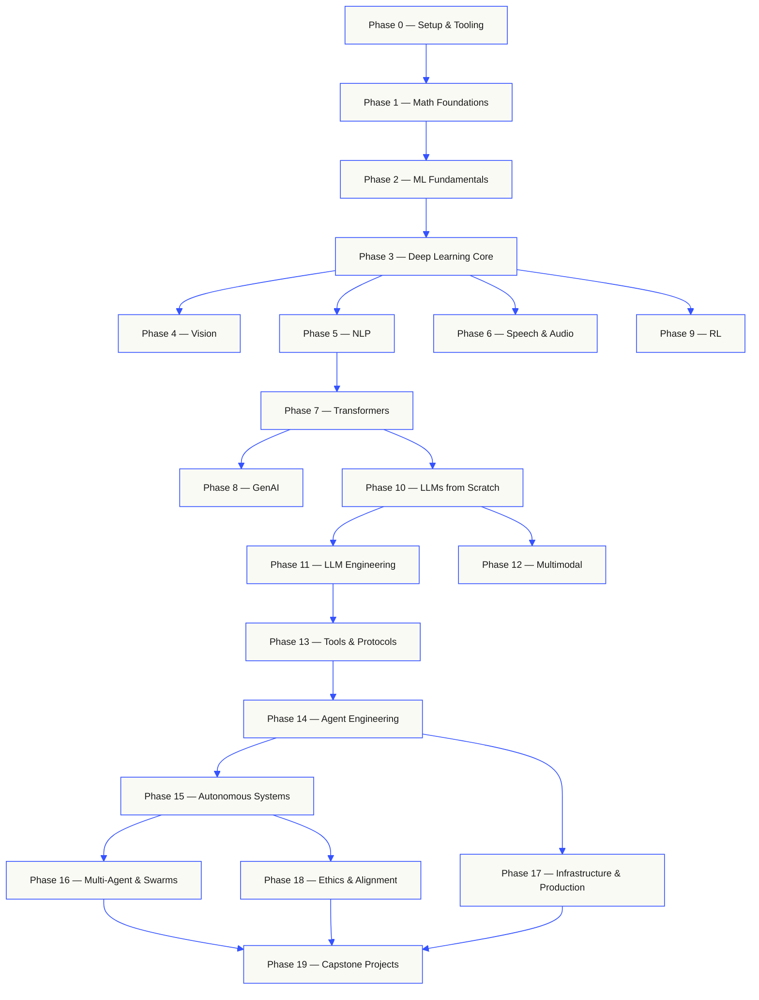
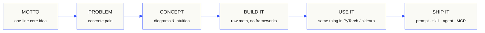

<!-- README-TRANSLATION-SOURCE:fd98cf49e2346d50ad9f0d92acbd2d6019c98fafaad3a3b74c8d3fa8ef2107db -->
<!-- README-LANGUAGES:START -->
<p align="center">
  <b>Read the full README in your language:</b>
  <a href="https://mayangle.github.io/ai-engineering-from-scratch/readme.html?lang=en">English</a> ·
  <a href="https://mayangle.github.io/ai-engineering-from-scratch/readme.html?lang=es">Español</a> ·
  <a href="https://mayangle.github.io/ai-engineering-from-scratch/readme.html?lang=fr">Français</a> ·
  <a href="https://mayangle.github.io/ai-engineering-from-scratch/readme.html?lang=pt">Português</a> ·
  <a href="https://mayangle.github.io/ai-engineering-from-scratch/readme.html?lang=de">Deutsch</a> ·
  <a href="https://mayangle.github.io/ai-engineering-from-scratch/readme.html?lang=it">Italiano</a> ·
  <a href="https://mayangle.github.io/ai-engineering-from-scratch/readme.html?lang=zh">简体中文</a> ·
  <a href="https://mayangle.github.io/ai-engineering-from-scratch/readme.html?lang=ja">日本語</a> ·
  <a href="https://mayangle.github.io/ai-engineering-from-scratch/readme.html?lang=ko">한국어</a> ·
  <a href="https://mayangle.github.io/ai-engineering-from-scratch/readme.html?lang=hi">हिन्दी</a> ·
  <a href="https://mayangle.github.io/ai-engineering-from-scratch/readme.html?lang=ar">العربية</a> ·
  <a href="https://mayangle.github.io/ai-engineering-from-scratch/readme.html?lang=ru">Русский</a> ·
  <a href="https://mayangle.github.io/ai-engineering-from-scratch/readme.html?lang=tr">Türkçe</a>
  <br><sub>The static reader switches the whole document in place. Commands, code, and repository paths remain unchanged. English is canonical; translations are generated with NLLB-200. See <a href="docs/i18n.md">docs/i18n.md</a>.</sub>
</p>
<!-- README-LANGUAGES:END -->

<p align="center">
  
</p>

<p align="center">
  <a href="LICENSE"></a>
  <a href="ROADMAP.md"></a>
  <a href="#contents"></a>
  <a href="https://github.com/rohitg00/ai-engineering-from-scratch/stargazers"></a>
  <a href="https://aiengineeringfromscratch.com"></a>
</p>

### 赞助方

<a href="https://serpapi.com/ai-engineering-from-scratch">
  
</a>

<p><br><b>感谢我们的赞助方。</b></p>
<p>你的支持让每节课都能保持免费和开源。</p>
<p>
  <a href="#supporters">查看所有支持者</a><br>
  <a href="SPONSORS.md">成为一个赞助商</a>
  <br clear="all">
</p>

```text
░░░▒▒▒░░░▒▒▒░░░▒▒▒░░░▒▒▒░░░▒▒▒░░░▒▒▒░░░▒▒▒░░░▒▒▒░░░▒▒▒░░░▒▒▒░░░▒▒▒░░░▒▒▒░░░▒▒▒░░░▒▒▒░░░▒▒▒
```

> **84% 的学生已经在使用 AI 工具，却只有 18% 觉得自己能专业地使用它们。** 这套课程正是为了填补这道鸿沟。
>
> 523 节课。20 个阶段。约 342 小时。Python、TypeScript、Rust、Julia。每节课都产出一个可复用的成果：一个提示词、一个技能、一个智能体、一个 MCP 服务器。免费、开源、MIT 许可。
>
> 你不只是学 AI，你亲手把它造出来。从头到尾，全部手写。

<!-- STATS:START (generated from site/stats.json by build.js — do not edit by hand) -->
<p align="center"><sub><b>114,584</b> 读者 &nbsp;·&nbsp; <b>181,995</b> 在过去30天的页面浏览 &nbsp;·&nbsp; 截至2026年08月29日</sub></p>
<!-- STATS:END -->

## 从这里开始：选择你想构建的东西

开始前不必先浏览 523 节课。选一个目标即可。每个链接都会打开同一套课程的 GitHub 或网站版本，两边使用相同的课程代码。

| 你的目标 | 在 GitHub 上学习 | 在网站上学习 |
|---|---|---|
| 我是新人,想要完整的基础. | [阶段0:设置和工具](phases/00-setup-and-tooling/) | [开发环境](https://aiengineeringfromscratch.com/lesson?path=phases/00-setup-and-tooling/01-dev-environment) |
| 我知道Python,我想数学加上 ML基础 | [第一个阶段:数学基础](phases/01-math-foundations/) | [线性代数直观](https://aiengineeringfromscratch.com/lesson?path=phases/01-math-foundations/01-linear-algebra-intuition) |
| 我想建立生产LLM应用程序 | [第11阶段:LLM工程](phases/11-llm-engineering/) | [快速工程](https://aiengineeringfromscratch.com/lesson?path=phases/11-llm-engineering/01-prompt-engineering) |
| 我想要建立代理人. | [第14阶段:代理工程](phases/14-agent-engineering/) | [环球代理](https://aiengineeringfromscratch.com/lesson?path=phases/14-agent-engineering/01-the-agent-loop) |
| 我想要在真正的存储库上使用编码代理 | [助理工程路径](learning-paths/using-coding-agents.json) | [代理助理工程](https://aiengineeringfromscratch.com/lesson?path=phases/14-agent-engineering/31-agent-workbench-why-models-fail&learningPath=using-coding-agents) |
| 在实施之前,我想制定正确的构建 | [产品评价和交付路径](learning-paths/shaping-the-build.json) | [产品评价和交付](https://aiengineeringfromscratch.com/lesson?path=phases/14-agent-engineering/47-outcomes-before-output&learningPath=shaping-the-build) |
| 我希望使用模型语境协议 (MCP) 构建 | [模式背景协议 (MCP) 路线](phases/13-tools-and-protocols/README.md#model-context-protocol-mcp-path) | [模型文本协议 (MCP) 路径](https://aiengineeringfromscratch.com/lesson?path=phases/13-tools-and-protocols/06-mcp-fundamentals&learningPath=model-context-protocol) |
| 我想要写出和发送特工技能 | [专注的代理技能路线](phases/13-tools-and-protocols/README.md#agent-skills-fast-path) | [代理技能路径](https://aiengineeringfromscratch.com/lesson?path=phases/13-tools-and-protocols/22-skills-and-agent-sdks&learningPath=agent-skills) |
| 我想准备好克劳德认证. | [认证登机](certifications/claude/GETTING_STARTED.md) | [认证学院](https://aiengineeringfromscratch.com/certifications.html) |
| 我想准备MCP副职员 (MCPA) | [MCPA 登陆](certifications/mcpa/GETTING_STARTED.md) | [道](https://aiengineeringfromscratch.com/certification?id=mcpa-f) |

不确定从哪里开始？试试 [`start-learning` 入门测评导师](skills/start-learning/SKILL.md)，或查看[网站的先修知识指南](https://aiengineeringfromscratch.com/prereqs.html)。

在 [AI 工程学习路径](https://aiengineeringfromscratch.com/learning-paths.html)中，对比四大核心领域和六条职业路线。

### 每节课都按同一方法学习

1. **阅读** `docs/en.md` 通过自己的话来解释核心思想.
2. **类型和构建** 重要代码,而不是把代码块当作装饰.
3. **跑步** 存储库根中的教训命令,包含目录 `README.md` 其他 `phases/`.
4. **保存证据**命令,工作目录,出口代码,有意义的输出,以及你改变或制作的文物.
5. **继续** 只有当你能解释输出,

除非课程明确要求切换目录，否则课程页面中的命令都应从仓库根目录运行。如果一节课提供多种编程语言，请运行你正在学习的那种实现。

### 克隆仓库，留下第一份学习证据

```bash
git clone https://github.com/rohitg00/ai-engineering-from-scratch.git
cd ai-engineering-from-scratch
python3 phases/00-setup-and-tooling/01-dev-environment/code/verify.py --route beginner
python3 phases/01-math-foundations/01-linear-algebra-intuition/code/vectors.py
```

环境预检会区分现在必需的工具和之后才需要的工具。每项必需检查若失败，都会说明检测到的原因，并给出修复命令。第二条命令运行一节不依赖第三方包的课程，最后展示神经网络层的核心运算：矩阵乘向量。请保存终端输出，作为你的第一份学习证据。

## 在30秒内添加人工智能教练

如果 Node.js, `npx`已安装了一个有能力的编码代理,
您的编码代理可以在两个命令中成为您的导师.
需要运行的专注路径实验室需要
`python3`机关机关的实验室还需要一个选择的机关机关和一个可编写的机关机关.
用户或项目技能范围.

首先要检查当地要求:

```bash
node --version
npx --version
python3 --version
```

然后安装课程技能,选择您打算的主机和范围
使用安装器要求:

```bash
npx skills add rohitg00/ai-engineering-from-scratch
```

调用语法属于主机,而不是便携式 `SKILL.md` 格式:

| 东道主 | 开始课程 | 启动模式语境协议 (MCP) | 开始代理技能 | 进行一个阶段测试 |
|---|---|---|---|---|
| 编辑 | `start-learning`或选择它 `/skills` | `learn-mcp`或选择它 `/skills` | `learn-agent-skills`或选择它 `/skills` | `check-understanding 13`或选择它 `/skills` |
| 克劳德代码 | `/start-learning` | `/learn-mcp` | `/learn-agent-skills` | `/check-understanding 13` |
| 其他兼容的主机 | `Use start-learning to begin the course.` | `Use learn-mcp to start the Model Context Protocol (MCP) path.` | `Use learn-agent-skills to start the Agent Skills Engineering path.` | `Use check-understanding to quiz me on Phase 13.` |

一个10个问题测试将你已经知道的内容映射到一个开始阶段,
保存一个个性化的学习计划 `LEARNING.md`从那里, `learn` 技能
每次课程都会给出一个课程:概念,数学,代码,测试.
直接从本次回报中, `course-guide` 技能让你达到精确的水平
在"编辑"中,请用
`learn` 其他 `course-guide`在"克劳德代码"中,使用 `/learn` 其他 `/course-guide`;
在其他兼容的主机中,请用名字使用技能.

只有需要模型语境协议 (MCP)?使用MCP调用为主机.它创建
`MCP-LEARNING.md` 通过无国籍的17课程
要求,运输,双向工作,安全性,可靠性,登记
具体的顺序和检查点在
其他 [模型文本协议 (MCP) 宣言](learning-paths/model-context-protocol.json).

只有要代理技能,用代理技能调用给主机.
创造 `AGENT-SKILLS-LEARNING.md` 按照一个连贯的五课程路线:
合同,发现,调用,沙盒边界,然后发布评估和
开始在网上使用
[代理技能路径](https://aiengineeringfromscratch.com/lesson?path=phases/13-tools-and-protocols/22-skills-and-agent-sdks&learningPath=agent-skills).

安装器列出可以配置的主机,并问安装地点.
你没有 Node.js, `npx`, `python3`支持的主机或可编写的
现在,使用网站或阅读 `docs/en.md` 通过手动.
概念,但实际主机发现,调用,脚本,和卸载证据
预航机在空中飞行之前仍在待定.
[工程从Scratch.com](https://aiengineeringfromscratch.com).

## 运作方式

很多人工智能教材都是分散的.
其他地方的代理演示. 零件很少排列. 你运送一个聊天机器人,但不能
您将函数连接到一个代理,但不能说注意力是什么.
在这个叫它的模型里.

这门课程是脊柱. 20个阶段, 523个课程,四种语言:
,朱莉亚. 一端的线性代数,另一端的自主群体.
首先是从原始数学中构建的. 后置. 标记器. 注意. 代理循环. 到那时,
皮托奇出现了,你已经知道它在罩杯下做什么了.

每个课程都是一样的循环:读出问题,得出数学,写代码,运行
没有五分钟的视频,没有复印贴,没有握手.
免费,开源,可以在自己的笔记本电脑上运行.

```text
░░░▒▒▒░░░▒▒▒░░░▒▒▒░░░▒▒▒░░░▒▒▒░░░▒▒▒░░░▒▒▒░░░▒▒▒░░░▒▒▒░░░▒▒▒░░░▒▒▒░░░▒▒▒░░░▒▒▒░░░▒▒▒░░░▒▒▒
```

## 课程的整体结构

两十年的时间,数学是地板,代理和生产是屋顶.
如果你已经知道下层,但不要跳过,然后想知道为什么
顶部正在破裂.



```text
░░░▒▒▒░░░▒▒▒░░░▒▒▒░░░▒▒▒░░░▒▒▒░░░▒▒▒░░░▒▒▒░░░▒▒▒░░░▒▒▒░░░▒▒▒░░░▒▒▒░░░▒▒▒░░░▒▒▒░░░▒▒▒░░░▒▒▒
```

## 单节课的结构

每个课程都存在于自己的文件中,

```text
phases/<NN>-<phase-name>/<NN>-<lesson-name>/
├── code/      runnable implementations (Python, TypeScript, Rust, Julia)
├── docs/
│   └── en.md  lesson narrative
└── outputs/   prompts, skills, agents, or MCP servers this lesson produces
```

每个课程都会有六次跳动.
首先从零开始,然后通过生产库运行相同的东西.
了解框架的作用,因为你自己写了较小的版本.



## 快速开始

三种入门方式，任选其一。

**选择A 学习在终端 *其他类型*.** 在 Node.js,
`npx`导航,导航,航线前航班,安装学习技能
兼容的代理,让课程自动驾驶:

```bash
npx skills add rohitg00/ai-engineering-from-scratch
```

通过使用上述主机特定调用表.
`start-learning`, `learn`, `course-guide`专注于
`learn-mcp` 其他 `learn-agent-skills` 课程:
没有克隆的流源从这个库中.
复制存储库代码命令和可执行的MCP或代理技能实验室.
进步生活在 `LEARNING.md`, `MCP-LEARNING.md`其他
`AGENT-SKILLS-LEARNING.md` 让每个会议都能恢复.

**选择B 阅读.** 开启任何完成的课程
[工程从Scratch.com](https://aiengineeringfromscratch.com) 或扩大一个阶段
[目录](#contents)没有设置,没有克隆.

**选择C  克隆并运行.**

```bash
git clone https://github.com/rohitg00/ai-engineering-from-scratch.git
cd ai-engineering-from-scratch
python3 phases/01-math-foundations/01-linear-algebra-intuition/code/vectors.py
```

克隆也自动加载了克劳德代码中的学习技能,
课程代码 `learn` 作为真正执行的教师,而不是读书.

### 先决条件

- 你可以写代码 (任何语言; Python 帮助).
- 你想了解人工智能是如何的 **实际上是有效的**没有只打电话.

### 准备克劳德认证

其他 [克劳德认证学院](certifications/claude/README.md) 是一个免费的,
开源准备方案,用于所有四个官方的克劳德认证轨道:
协会基金会,开发者基金会,建筑师基金会和建筑师
每个路线都结合了蓝图绘制的课程,可运行的实验室,
诊断,结石工作,以及一个完整的原始实践考试.

使用 [基于AI的 GitHub 登录指南](certifications/claude/GETTING_STARTED.md)
通过克劳德代码,Codex,ChatGPT,Cursor或其他代理.
`claude-certification` 在"编辑"中, `/claude-certification` 在克劳德代码中,或者问
其他使用的主机 `claude-certification`它选择了轨道,创造了一个
持续的路线 `CLAUDE-CERTIFICATION.md`让你学会一步一步,
实验室,并提供基于文物的反.
在 [认证网站](https://aiengineeringfromscratch.com/certifications.html).

根据公开考试目标,该学院是独立的学习材料.
没有再现实考试问题,不能保证
通过得分.

### 准备MCP联席认证 (MCPA)

其他 [MCPA认证课程](certifications/mcpa/README.md) 是一个免费的,
开源准备方案,为模范文本协议副考试
通过Linux基金会培训提供的"代理人工智能基金会".
五个考试领域的无国籍2026-07-28协议:按要求 `_meta` 其他
`server/discover` 换取旧的握手,多次回来请求,订阅,
缓存,任务和MCP应用程序扩展,OAuth授权,以及注册表和SDK
每个课程都会运行一个可运行的标准图书馆,
现在的电线形状,轨道增加了诊断,一个顶石,和三个全长
考试的内容是根据公布的蓝图重量.

使用 [基于AI的 GitHub 登录指南](certifications/mcpa/GETTING_STARTED.md) 随着
克劳德代码,Codex,ChatGPT,Cursor,或其他代理. `mcpa-certification` 在"编辑"中,
`/mcpa-certification` 在Cloed Code中,或者请其他主机使用 `mcpa-certification`现在,我在
创造一个持续的路线 `MCPA-CERTIFICATION.md`让你学会一步一步,
实验室,并提供基于文物的反.
[美国国家公积金协会 (MCPA) 轨迹页面](https://aiengineeringfromscratch.com/certification?id=mcpa-f).

课程是基于公开考试目标的独立学习材料.
与Agentic AI基金会或Linux基金会相关,不复制
没有保证合格的成绩.

### 学习技能

| 技能 | 它所做的 |
|---|---|
| [`start-learning`](skills/start-learning/SKILL.md) | 一次登录:为什么你学习, 位数测试,个性化计划保存到 `LEARNING.md`. |
| [`learn`](skills/learn/SKILL.md) | 接下来,下一个课程进行互动,然后,它的测试,记录进度和回顾队列. |
| [`course-guide`](skills/course-guide/SKILL.md) | 专题路由器. "我在哪里学会注意力?"或"我的损失是NaN" →精确的教训, |
| [`learn-mcp`](skills/learn-mcp/SKILL.md) | 专注模型文本协议 (MCP) 导师. `MCP-LEARNING.md`根据17课程的说明书,记录了线索,安全性,可靠性和符合性证据. |
| [`learn-agent-skills`](skills/learn-agent-skills/SKILL.md) | 专注的特工技能教师. `AGENT-SKILLS-LEARNING.md`课程22,24,25,26和27节,并记录了实体主持人的证据. |
| [`claude-certification`](skills/claude-certification/SKILL.md) | 认证导师:选择CCAO-F,CCDV-F,CCAR-F或CCAR-P;教每个课程;运行实验室;审查文物;管理诊断和模拟;保存进展. |
| [`mcpa-certification`](skills/mcpa-certification/SKILL.md) | 学生学习课程,课程34 `mcpa-f` 通过2026-07-28协议进行路线,每堂课,运行实验室和电线检查器,进行诊断和三次模拟,节省进展. |
| [`find-your-level`](skills/find-your-level/SKILL.md) | 测试题满10个问题,将你的知识映射到一个开始阶段,并产生一个个性化的路径, |
| [`check-understanding <phase>`](skills/check-understanding/SKILL.md) | 按阶段问卷,八个问题,含反和具体的课程. |

```text
░░░▒▒▒░░░▒▒▒░░░▒▒▒░░░▒▒▒░░░▒▒▒░░░▒▒▒░░░▒▒▒░░░▒▒▒░░░▒▒▒░░░▒▒▒░░░▒▒▒░░░▒▒▒░░░▒▒▒░░░▒▒▒░░░▒▒▒
```

## 阅读核心课程作为一本书

根据20个阶段的核心课程 `phases/` 基于同一个核心课程来源,EPUB和PDF由CI构建,并附加到每一个课程中. [GitHub 发布](https://github.com/rohitg00/ai-engineering-from-scratch/releases)总是将下面的链接归档到最新版本. 卷号是指数列表,而不是版本:每张复印件都包含了已出期的印花,旧版本从发布后仍然可下载.

认证课程是故意不转化为书籍的.
智能化教师状态,可运行实验室,互动数据,诊断和定时模拟
在 GitHub 和网站上仍然是第一类.

| 排行第 1 | 标题 | 阶段 | 下载 |
|-----|-------|--------|----------|
| 1 | 基础知识 · 数学,工具和经典机器学习 | 00-02 | [电子书](https://github.com/rohitg00/ai-engineering-from-scratch/releases/latest/download/aiefs-vol1-foundations.epub) · [文件](https://github.com/rohitg00/ai-engineering-from-scratch/releases/latest/download/aiefs-vol1-foundations.pdf) |
| 2 | 深度学习 ·网络,视觉和演讲 | 03, 04, 06 | [电子书](https://github.com/rohitg00/ai-engineering-from-scratch/releases/latest/download/aiefs-vol2-deep-learning.epub) · [文件](https://github.com/rohitg00/ai-engineering-from-scratch/releases/latest/download/aiefs-vol2-deep-learning.pdf) |
| 3 | 语言 · NLP 基础和变压器 | 05, 07 | [电子书](https://github.com/rohitg00/ai-engineering-from-scratch/releases/latest/download/aiefs-vol3-language.epub) · [文件](https://github.com/rohitg00/ai-engineering-from-scratch/releases/latest/download/aiefs-vol3-language.pdf) |
| 4 | 语言模型 · 产生,加强,预训练和工程 | 08-11 | [电子书](https://github.com/rohitg00/ai-engineering-from-scratch/releases/latest/download/aiefs-vol4-llms.epub) · [文件](https://github.com/rohitg00/ai-engineering-from-scratch/releases/latest/download/aiefs-vol4-llms.pdf) |
| 5 | 代理商 · 多型性,协议,自主性和群体 | 12-16 | [电子书](https://github.com/rohitg00/ai-engineering-from-scratch/releases/latest/download/aiefs-vol5-agents.epub) · [文件](https://github.com/rohitg00/ai-engineering-from-scratch/releases/latest/download/aiefs-vol5-agents.pdf) |
| 6 | 生产 · 基础设施,安全和石头 | 17-19 | [电子书](https://github.com/rohitg00/ai-engineering-from-scratch/releases/latest/download/aiefs-vol6-production.epub) · [文件](https://github.com/rohitg00/ai-engineering-from-scratch/releases/latest/download/aiefs-vol6-production.pdf) |

每个章节都以回复课程的动画数字,问卷和可运行代码的链接结束. `python3 scripts/build_book.py` 需要一张文件; [书/README.md](book/README.md).

```text
░░░▒▒▒░░░▒▒▒░░░▒▒▒░░░▒▒▒░░░▒▒▒░░░▒▒▒░░░▒▒▒░░░▒▒▒░░░▒▒▒░░░▒▒▒░░░▒▒▒░░░▒▒▒░░░▒▒▒░░░▒▒▒░░░▒▒▒
```

## 每节课都有产出

其他课程以 *"祝,你学到了X.* 每个课程都以一个
**可重复使用的工具** 您可以将其安装或粘贴到您的日常工作流程中.

<table>
<tr>
<th align="left" width="25%"><br/><sub>图_001 · A</sub><br/><b>预示</b></th>
<th align="left" width="25%"><br/><sub>图_001 · B</sub><br/><b>技能</b></th>
<th align="left" width="25%"><br/><sub>图_001 · C</sub><br/><b>代理人</b></th>
<th align="left" width="25%"><br/><sub>图_001 · D</sub><br/><b>服务器</b></th>
</tr>
<tr>
<td valign="top">通过任何人工智能助理来帮助你完成一个狭的任务.</td>
<td valign="top">放进克劳德,Cursor,Codex,OpenClaw,Hermes,或任何读取的代理 <code>SKILL.md</code>.</td>
<td valign="top">作为自主工作者,你自己在14阶段写下了循环.</td>
<td valign="top">连接到任何MCP兼容的客户端.</td>
</tr>
</table>

> 装备了很多 `python3 scripts/install_skills.py <target>`实际的工具,不是作业.
> 在课程结束时,你将拥有523件你实际上
> 因为你自己建造了它们.

### 图_002 · 加工样本

阶段14:课1:代理循环. 纯Python的120行,没有依赖.

<table>
<tr>
<td valign="top" width="50%">

**`code/agent_loop.py`** &nbsp; <sub><i>建造它</i></sub>

```python
def run(query, tools):
    history = [user(query)]
    for step in range(MAX_STEPS):
        msg = llm(history)
        if msg.tool_calls:
            for call in msg.tool_calls:
                result = tools[call.name](**call.args)
                history.append(tool_result(call.id, result))
            continue
        return msg.content
    raise StepLimitExceeded
```

</td>
<td valign="top" width="50%">

**`outputs/skill-agent-loop.md`** &nbsp; <sub><i>运送它</i></sub>

```markdown
---
name: agent-loop
description: ReAct-style loop for any tool list
phase: 14
lesson: 01
---

Implement a minimal agent loop that...
```

**`outputs/prompt-debug-agent.md`**

```markdown
You are an agent debugger. Given the trace
of an agent run, identify the step where
the agent went wrong and explain why...
```

</td>
</tr>
</table>

```text
░░░▒▒▒░░░▒▒▒░░░▒▒▒░░░▒▒▒░░░▒▒▒░░░▒▒▒░░░▒▒▒░░░▒▒▒░░░▒▒▒░░░▒▒▒░░░▒▒▒░░░▒▒▒░░░▒▒▒░░░▒▒▒░░░▒▒▒
```

<a id="contents"></a>

## 目录

按任何阶段扩大课程列表.

<a id="phase-0"></a>
### 阶段0:设置和工具 `12 lessons`
> 准备好自己的环境,

| # | 经验 | 类型 | 长 |
|:---:|--------|:----:|------|
| 01 | [开发环境](phases/00-setup-and-tooling/01-dev-environment/) | 建立 | 字符串 |
| 02 | [关键字和协作](phases/00-setup-and-tooling/02-git-and-collaboration/) | 学习 | — |
| 03 | [GPU 设置和云](phases/00-setup-and-tooling/03-gpu-setup-and-cloud/) | 建立 | 字符串 |
| 04 | [应用程序和关键](phases/00-setup-and-tooling/04-apis-and-keys/) | 建立 | 字符串 |
| 05 | [朱皮特笔记本](phases/00-setup-and-tooling/05-jupyter-notebooks/) | 建立 | 字符串 |
| 06 | [字符串环境](phases/00-setup-and-tooling/06-python-environments/) | 建立 | 子 |
| 07 | [对于AI的Docker](phases/00-setup-and-tooling/07-docker-for-ai/) | 建立 | 机械设备 |
| 08 | [编辑器设置](phases/00-setup-and-tooling/08-editor-setup/) | 建立 | — |
| 09 | [数据管理](phases/00-setup-and-tooling/09-data-management/) | 建立 | 字符串 |
| 10 | [终端和](phases/00-setup-and-tooling/10-terminal-and-shell/) | 学习 | — |
| 11 | [对于人工智能的Linux](phases/00-setup-and-tooling/11-linux-for-ai/) | 学习 | — |
| 12 | [调整和配置](phases/00-setup-and-tooling/12-debugging-and-profiling/) | 建立 | 字符串 |

<details id="phase-1">
<summary><b>第一个阶段 数学基础</b> &nbsp;<code>22 lessons</code>&nbsp; <em>通过代码,每个人工智能算法背后的直觉.</em></summary>
<br/>

| # | 经验 | 类型 | 长 |
|:---:|--------|:----:|------|
| 01 | [线性代数直观](phases/01-math-foundations/01-linear-algebra-intuition/) | 学习 | 皮森,朱莉亚 |
| 02 | [矢量,矩阵和运算](phases/01-math-foundations/02-vectors-matrices-operations/) | 建立 | 皮森,朱莉亚 |
| 03 | [矩阵变化和自有值](phases/01-math-foundations/03-matrix-transformations/) | 建立 | 皮森,朱莉亚 |
| 04 | [计算ML:衍生品和渐变物](phases/01-math-foundations/04-calculus-for-ml/) | 学习 | 字符串 |
| 05 | [链条规则和自动区分](phases/01-math-foundations/05-chain-rule-and-autodiff/) | 建立 | 字符串 |
| 06 | [概率和分布](phases/01-math-foundations/06-probability-and-distributions/) | 学习 | 字符串 |
| 07 | [贝叶斯定理和统计思维](phases/01-math-foundations/07-bayes-theorem/) | 建立 | 字符串 |
| 08 | [优化:渐进的后裔家庭](phases/01-math-foundations/08-optimization/) | 建立 | 字符串 |
| 09 | [信息理论:透,KL差异](phases/01-math-foundations/09-information-theory/) | 学习 | 字符串 |
| 10 | [尺寸降低:PCA,t-SNE,UMAP](phases/01-math-foundations/10-dimensionality-reduction/) | 建立 | 字符串 |
| 11 | [单一值分解](phases/01-math-foundations/11-singular-value-decomposition/) | 建立 | 皮森,朱莉亚 |
| 12 | [度操作](phases/01-math-foundations/12-tensor-operations/) | 建立 | 字符串 |
| 13 | [数字稳定性](phases/01-math-foundations/13-numerical-stability/) | 建立 | 字符串 |
| 14 | [规范和距离](phases/01-math-foundations/14-norms-and-distances/) | 建立 | 字符串 |
| 15 | [关于 ML 的统计数据](phases/01-math-foundations/15-statistics-for-ml/) | 建立 | 字符串 |
| 16 | [采样方法](phases/01-math-foundations/16-sampling-methods/) | 建立 | 字符串 |
| 17 | [线性系统](phases/01-math-foundations/17-linear-systems/) | 建立 | 字符串 |
| 18 | [曲的优化](phases/01-math-foundations/18-convex-optimization/) | 建立 | 字符串 |
| 19 | [复杂的AI数字](phases/01-math-foundations/19-complex-numbers/) | 学习 | 字符串 |
| 20 | [富里尔变形](phases/01-math-foundations/20-fourier-transform/) | 建立 | 字符串 |
| 21 | [图形理论对于 ML](phases/01-math-foundations/21-graph-theory/) | 建立 | 字符串 |
| 22 | [断过程](phases/01-math-foundations/22-stochastic-processes/) | 学习 | 字符串 |

</details>

<details id="phase-2">
<summary><b>第二阶段  ML基本知识</b> &nbsp;<code>18 lessons</code>&nbsp; <em>经典的 ML 仍然是大多数生产人工智能的脊柱.</em></summary>
<br/>

| # | 经验 | 类型 | 长 |
|:---:|--------|:----:|------|
| 01 | [机器学习是什么?](phases/02-ml-fundamentals/01-what-is-machine-learning/) | 学习 | 字符串 |
| 02 | [从零开始的线性回归](phases/02-ml-fundamentals/02-linear-regression/) | 建立 | 字符串 |
| 03 | [物流回归和分类](phases/02-ml-fundamentals/03-logistic-regression/) | 建立 | 字符串 |
| 04 | [决策树木和随机森林](phases/02-ml-fundamentals/04-decision-trees/) | 建立 | 字符串 |
| 05 | [支持向量机](phases/02-ml-fundamentals/05-support-vector-machines/) | 建立 | 字符串 |
| 06 | [距离指标](phases/02-ml-fundamentals/06-knn-and-distances/) | 建立 | 字符串 |
| 07 | [无监督学习:K-Means,DBSCAN](phases/02-ml-fundamentals/07-unsupervised-learning/) | 建立 | 字符串 |
| 08 | [功能工程和选择](phases/02-ml-fundamentals/08-feature-engineering/) | 建立 | 字符串 |
| 09 | [模型评估:指标,交叉验证](phases/02-ml-fundamentals/09-model-evaluation/) | 建立 | 字符串 |
| 10 | [偏见,差异和学习曲线](phases/02-ml-fundamentals/10-bias-variance/) | 学习 | 字符串 |
| 11 | [组装方法:增强,包装,堆叠](phases/02-ml-fundamentals/11-ensemble-methods/) | 建立 | 字符串 |
| 12 | [超参数调整](phases/02-ml-fundamentals/12-hyperparameter-tuning/) | 建立 | 字符串 |
| 13 | [道和实验跟踪](phases/02-ml-fundamentals/13-ml-pipelines/) | 建立 | 字符串 |
| 14 | [简单的贝尔斯](phases/02-ml-fundamentals/14-naive-bayes/) | 建立 | 字符串 |
| 15 | [时间系列的基本知识](phases/02-ml-fundamentals/15-time-series/) | 建立 | 字符串 |
| 16 | [异常检测](phases/02-ml-fundamentals/16-anomaly-detection/) | 建立 | 字符串 |
| 17 | [处理不平衡的数据](phases/02-ml-fundamentals/17-imbalanced-data/) | 建立 | 字符串 |
| 18 | [功能选择](phases/02-ml-fundamentals/18-feature-selection/) | 建立 | 字符串 |

</details>

<details id="phase-3">
<summary><b>阶段3 深度学习核心</b> &nbsp;<code>13 lessons</code>&nbsp; <em>只有你建立一个框架.</em></summary>
<br/>

| # | 经验 | 类型 | 长 |
|:---:|--------|:----:|------|
| 01 | [感知器:一切的开始](phases/03-deep-learning-core/01-the-perceptron/) | 建立 | 字符串 |
| 02 | [多层网络和前行通行](phases/03-deep-learning-core/02-multi-layer-networks/) | 建立 | 字符串 |
| 03 | [从零开始向后传播](phases/03-deep-learning-core/03-backpropagation/) | 建立 | 字符串 |
| 04 | [激活功能:RLU,Sigmoid,GELU和为什么](phases/03-deep-learning-core/04-activation-functions/) | 建立 | 字符串 |
| 05 | [损失功能:MSE,交叉透,对比性](phases/03-deep-learning-core/05-loss-functions/) | 建立 | 字符串 |
| 06 | [优化器:SGD,动力,亚当,亚当W](phases/03-deep-learning-core/06-optimizers/) | 建立 | 字符串 |
| 07 | [规范性:减肥,减肥,批量](phases/03-deep-learning-core/07-regularization/) | 建立 | 字符串 |
| 08 | [体重初始化和训练稳定性](phases/03-deep-learning-core/08-weight-initialization/) | 建立 | 字符串 |
| 09 | [学习时间表和热点](phases/03-deep-learning-core/09-learning-rate-schedules/) | 建立 | 字符串 |
| 10 | [建立自己的迷你框架](phases/03-deep-learning-core/10-mini-framework/) | 建立 | 字符串 |
| 11 | [介绍PyTorch](phases/03-deep-learning-core/11-intro-to-pytorch/) | 建立 | 字符串 |
| 12 | [介绍JAX](phases/03-deep-learning-core/12-intro-to-jax/) | 建立 | 字符串 |
| 13 | [调解神经网络](phases/03-deep-learning-core/13-debugging-neural-networks/) | 建立 | 字符串 |

</details>

<details id="phase-4">
<summary><b>阶段4 计算机视觉</b> &nbsp;<code>28 lessons</code>&nbsp; <em>从像素到理解图像,视频,3D,VLM和世界模型.</em></summary>
<br/>

| # | 经验 | 类型 | 长 |
|:---:|--------|:----:|------|
| 01 | [图像基础:像素,道,颜色空间](phases/04-computer-vision/01-image-fundamentals/) | 学习 | 字符串 |
| 02 | [从零开始的转变](phases/04-computer-vision/02-convolutions-from-scratch/) | 建立 | 字符串 |
| 03 | [网络网络:雷网到雷斯网](phases/04-computer-vision/03-cnns-lenet-to-resnet/) | 建立 | 字符串 |
| 04 | [图像分类](phases/04-computer-vision/04-image-classification/) | 建立 | 字符串 |
| 05 | [转移学习和调整](phases/04-computer-vision/05-transfer-learning/) | 建立 | 字符串 |
| 06 | [从零开始检测到物体](phases/04-computer-vision/06-object-detection-yolo/) | 建立 | 字符串 |
| 07 | [语义分类 U-Net](phases/04-computer-vision/07-semantic-segmentation-unet/) | 建立 | 字符串 |
| 08 | [机器人机器人机器人机器人机器人机器人机器人机器人机器人机器人机器人机器人机器人机器人机器人机器人机器人机器人机器人机器人机器人机器人机器人机器人机器人机器人机器人机器人机器人机器人机器人机器人机器人机器人机器人机器人机器人机器人机器人机器人机器人机器人机器人机器人机器人机器人机器人机器人机器人机器人机器人机器人机器人机器人机器人机器人机器人机器人机器人机器人机器人机器人机器人机器人机器人机器人机器人机器人机器人机器人机器人机器人机器人机器人机器人机器人机器人机器人机器人机器人机器人机器](phases/04-computer-vision/08-instance-segmentation-mask-rcnn/) | 建立 | 字符串 |
| 09 | [图像生成 GAN](phases/04-computer-vision/09-image-generation-gans/) | 建立 | 字符串 |
| 10 | [图像生成  扩散模型](phases/04-computer-vision/10-image-generation-diffusion/) | 建立 | 字符串 |
| 11 | [稳定扩散 建筑和精细调节](phases/04-computer-vision/11-stable-diffusion/) | 建立 | 字符串 |
| 12 | [视频理解 暂时模拟](phases/04-computer-vision/12-video-understanding/) | 建立 | 字符串 |
| 13 | [视觉3D:点云,NeRF](phases/04-computer-vision/13-3d-vision-nerf/) | 建立 | 字符串 |
| 14 | [视力转换器 (ViT)](phases/04-computer-vision/14-vision-transformers/) | 建立 | 字符串 |
| 15 | [实时视觉:边缘部署](phases/04-computer-vision/15-real-time-edge/) | 建立 | 字符串 |
| 16 | [建立一个完整的视觉管道](phases/04-computer-vision/16-vision-pipeline-capstone/) | 建立 | 字符串 |
| 17 | [自我监督视觉  SimCLR,DINO,MAE](phases/04-computer-vision/17-self-supervised-vision/) | 建立 | 字符串 |
| 18 | [开放语境视觉 CLIP](phases/04-computer-vision/18-open-vocab-clip/) | 建立 | 字符串 |
| 19 | [欧CR和文件理解](phases/04-computer-vision/19-ocr-document-understanding/) | 建立 | 字符串 |
| 20 | [图像检索和测量学习](phases/04-computer-vision/20-image-retrieval-metric/) | 建立 | 字符串 |
| 21 | [关键点检测和姿势估计](phases/04-computer-vision/21-keypoint-pose/) | 建立 | 字符串 |
| 22 | [从零开始进行3D高斯式光](phases/04-computer-vision/22-3d-gaussian-splatting/) | 建立 | 字符串 |
| 23 | [散变压器和调整流量](phases/04-computer-vision/23-diffusion-transformers-rectified-flow/) | 建立 | 字符串 |
| 24 | [SAM 3 和开放词库分类](phases/04-computer-vision/24-sam3-open-vocab-segmentation/) | 建立 | 字符串 |
| 25 | [视觉语言模型 (ViT-MLP-LLM)](phases/04-computer-vision/25-vision-language-models/) | 建立 | 字符串 |
| 26 | [单光深度和几何估计](phases/04-computer-vision/26-monocular-depth/) | 建立 | 字符串 |
| 27 | [多个对象跟踪和视频内存](phases/04-computer-vision/27-multi-object-tracking/) | 建立 | 字符串 |
| 28 | [世界模特和视频传播](phases/04-computer-vision/28-world-models-video-diffusion/) | 建立 | 字符串 |

</details>

<details id="phase-5">
<summary><b>五阶段  NLP:先进技术的基础</b> &nbsp;<code>29 lessons</code>&nbsp; <em>语言是智能界面.</em></summary>
<br/>

| # | 经验 | 类型 | 长 |
|:---:|--------|:----:|------|
| 01 | [文字处理:标记化,源源,化](phases/05-nlp-foundations-to-advanced/01-text-processing/) | 建立 | 字符串 |
| 02 | [字体包,TF-IDF和文本表示](phases/05-nlp-foundations-to-advanced/02-bag-of-words-tfidf/) | 建立 | 字符串 |
| 03 | [Word嵌入式:从零开始 Word2Vec](phases/05-nlp-foundations-to-advanced/03-word-embeddings-word2vec/) | 建立 | 字符串 |
| 04 | [GloVe,FastText和字幕嵌入](phases/05-nlp-foundations-to-advanced/04-glove-fasttext-subword/) | 建立 | 字符串 |
| 05 | [感觉分析](phases/05-nlp-foundations-to-advanced/05-sentiment-analysis/) | 建立 | 字符串 |
| 06 | [名称实体认可 (NER)](phases/05-nlp-foundations-to-advanced/06-named-entity-recognition/) | 建立 | 字符串 |
| 07 | [标签和语法解析](phases/05-nlp-foundations-to-advanced/07-pos-tagging-parsing/) | 建立 | 字符串 |
| 08 | [文字分类 文字的CNN和RNN](phases/05-nlp-foundations-to-advanced/08-cnns-rnns-for-text/) | 建立 | 字符串 |
| 09 | [序列到序列模型](phases/05-nlp-foundations-to-advanced/09-sequence-to-sequence/) | 建立 | 字符串 |
| 10 | [关注机制 突破](phases/05-nlp-foundations-to-advanced/10-attention-mechanism/) | 建立 | 字符串 |
| 11 | [机器翻译](phases/05-nlp-foundations-to-advanced/11-machine-translation/) | 建立 | 字符串 |
| 12 | [文本总结](phases/05-nlp-foundations-to-advanced/12-text-summarization/) | 建立 | 字符串 |
| 13 | [答案系统](phases/05-nlp-foundations-to-advanced/13-question-answering/) | 建立 | 字符串 |
| 14 | [获取信息和搜索](phases/05-nlp-foundations-to-advanced/14-information-retrieval-search/) | 建立 | 字符串 |
| 15 | [专题模拟:LDA,BERTopic](phases/05-nlp-foundations-to-advanced/15-topic-modeling/) | 建立 | 字符串 |
| 16 | [文字生成](phases/05-nlp-foundations-to-advanced/16-text-generation-pre-transformer/) | 建立 | 字符串 |
| 17 | [聊天机器人:基于规则到神经系统](phases/05-nlp-foundations-to-advanced/17-chatbots-rule-to-neural/) | 建立 | 字符串 |
| 18 | [多语言NLP](phases/05-nlp-foundations-to-advanced/18-multilingual-nlp/) | 建立 | 字符串 |
| 19 | [字母标记:BPE,WordPiece,单字符号,句子Piece](phases/05-nlp-foundations-to-advanced/19-subword-tokenization/) | 学习 | 字符串 |
| 20 | [结构化输出和限制式解码](phases/05-nlp-foundations-to-advanced/20-structured-outputs-constrained-decoding/) | 建立 | 字符串 |
| 21 | [信息化和文本性相关性](phases/05-nlp-foundations-to-advanced/21-nli-textual-entailment/) | 学习 | 字符串 |
| 22 | [嵌入模型 深入潜水](phases/05-nlp-foundations-to-advanced/22-embedding-models-deep-dive/) | 学习 | 字符串 |
| 23 | [碎的RAG策略](phases/05-nlp-foundations-to-advanced/23-chunking-strategies-rag/) | 建立 | 字符串 |
| 24 | [核心提议](phases/05-nlp-foundations-to-advanced/24-coreference-resolution/) | 学习 | 字符串 |
| 25 | [实体链接和含义不一致](phases/05-nlp-foundations-to-advanced/25-entity-linking/) | 建立 | 字符串 |
| 26 | [关系提取与知识图构建](phases/05-nlp-foundations-to-advanced/26-relation-extraction-kg/) | 建立 | 字符串 |
| 27 | [法律法学士评价:RAGAS,DeepEval,G-Eval](phases/05-nlp-foundations-to-advanced/27-llm-evaluation-frameworks/) | 建立 | 字符串 |
| 28 | [长文本评估:NIAH,RULER,LongBench,MRCR](phases/05-nlp-foundations-to-advanced/28-long-context-evaluation/) | 学习 | 字符串 |
| 29 | [对话状态跟踪](phases/05-nlp-foundations-to-advanced/29-dialogue-state-tracking/) | 建立 | 字符串 |

</details>

<details id="phase-6">
<summary><b>第六阶段  演讲和音频</b> &nbsp;<code>17 lessons</code>&nbsp; <em>听,理解,说.</em></summary>
<br/>

| # | 经验 | 类型 | 长 |
|:---:|--------|:----:|------|
| 01 | [音频基础:波形,样本,FFT](phases/06-speech-and-audio/01-audio-fundamentals) | 学习 | 字符串 |
| 02 | [频谱,梅尔尺度和音频特征](phases/06-speech-and-audio/02-spectrograms-mel-features) | 建立 | 字符串 |
| 03 | [音频分类](phases/06-speech-and-audio/03-audio-classification) | 建立 | 字符串 |
| 04 | [语音识别 (ASR)](phases/06-speech-and-audio/04-speech-recognition-asr) | 建立 | 字符串 |
| 05 | [语:建筑和精细调节](phases/06-speech-and-audio/05-whisper-architecture-finetuning) | 建立 | 字符串 |
| 06 | [发言人识别和验证](phases/06-speech-and-audio/06-speaker-recognition-verification) | 建立 | 字符串 |
| 07 | [文字与语音 (TTS)](phases/06-speech-and-audio/07-text-to-speech) | 建立 | 字符串 |
| 08 | [语音克隆和语音转换](phases/06-speech-and-audio/08-voice-cloning-conversion) | 建立 | 字符串 |
| 09 | [音乐代](phases/06-speech-and-audio/09-music-generation) | 建立 | 字符串 |
| 10 | [音频语言模型](phases/06-speech-and-audio/10-audio-language-models) | 建立 | 字符串 |
| 11 | [实时音频处理](phases/06-speech-and-audio/11-real-time-audio-processing) | 建立 | 字符串 |
| 12 | [建立一个语音助理管道](phases/06-speech-and-audio/12-voice-assistant-pipeline) | 建立 | 字符串 |
| 13 | [网络音频编码器  EnCodec,SNAC,Mimi,DAC](phases/06-speech-and-audio/13-neural-audio-codecs) | 学习 | 字符串 |
| 14 | [声活动检测和转移](phases/06-speech-and-audio/14-voice-activity-detection-turn-taking) | 建立 | 字符串 |
| 15 | [流媒体语音语音 莫希,希比基](phases/06-speech-and-audio/15-streaming-speech-to-speech-moshi-hibiki) | 学习 | 字符串 |
| 16 | [声音反伪造和音频水标](phases/06-speech-and-audio/16-anti-spoofing-audio-watermarking) | 建立 | 字符串 |
| 17 | [音频评估  WER, MOS, MMAU,排名表](phases/06-speech-and-audio/17-audio-evaluation-metrics) | 学习 | 字符串 |

</details>

<details id="phase-7">
<summary><b>转变器深入潜水</b> &nbsp;<code>16 lessons</code>&nbsp; <em>建筑物改变了一切.</em></summary>
<br/>

| # | 经验 | 类型 | 长 |
|:---:|--------|:----:|------|
| 01 | [为什么变革器:RNN的问题](phases/07-transformers-deep-dive/01-why-transformers/) | 学习 | 字符串 |
| 02 | [自从零开始注意自己](phases/07-transformers-deep-dive/02-self-attention-from-scratch/) | 建立 | 字符串 |
| 03 | [多头注意力](phases/07-transformers-deep-dive/03-multi-head-attention/) | 建立 | 字符串 |
| 04 | [位置编码:鼻状,ROPE,ALiBi](phases/07-transformers-deep-dive/04-positional-encoding/) | 建立 | 字符串 |
| 05 | [完全变压器:编码器+解码器](phases/07-transformers-deep-dive/05-full-transformer/) | 建立 | 字符串 |
| 06 | [面具语言建模](phases/07-transformers-deep-dive/06-bert-masked-language-modeling/) | 建立 | 字符串 |
| 07 | [原因语言建模](phases/07-transformers-deep-dive/07-gpt-causal-language-modeling/) | 建立 | 字符串 |
| 08 | [编码器-解码器模型](phases/07-transformers-deep-dive/08-t5-bart-encoder-decoder/) | 学习 | 字符串 |
| 09 | [视力转换器 (ViT)](phases/07-transformers-deep-dive/09-vision-transformers/) | 建立 | 字符串 |
| 10 | [音频变换器  语架构](phases/07-transformers-deep-dive/10-audio-transformers-whisper/) | 学习 | 字符串 |
| 11 | [专家组合 (MoE)](phases/07-transformers-deep-dive/11-mixture-of-experts/) | 建立 | 字符串 |
| 12 | [缓存,闪光注意力和推理优化](phases/07-transformers-deep-dive/12-kv-cache-flash-attention/) | 建立 | 字符串 |
| 13 | [规模规则](phases/07-transformers-deep-dive/13-scaling-laws/) | 学习 | 字符串 |
| 14 | [从零开始建造变压器](phases/07-transformers-deep-dive/14-build-a-transformer-capstone/) | 建立 | 字符串 |
| 15 | [注意 变量 滑动窗口,稀疏,差异性](phases/07-transformers-deep-dive/15-attention-variants/) | 建立 | 字符串 |
| 16 | [预测解码 草稿,验证,重复](phases/07-transformers-deep-dive/16-speculative-decoding/) | 建立 | 字符串 |

</details>

<details id="phase-8">
<summary><b>八阶段 生成人工智能</b> &nbsp;<code>15 lessons</code>&nbsp; <em>创建图像,视频,音频,3D等.</em></summary>
<br/>

| # | 经验 | 类型 | 长 |
|:---:|--------|:----:|------|
| 01 | [生成模型:类学与历史](phases/08-generative-ai/01-generative-models-taxonomy-history/) | 学习 | 字符串 |
| 02 | [自动编码器和VAE](phases/08-generative-ai/02-autoencoders-vae/) | 建立 | 字符串 |
| 03 | [产品:发电机与分辨器](phases/08-generative-ai/03-gans-generator-discriminator/) | 建立 | 字符串 |
| 04 | [条件GANs & Pix2Pix](phases/08-generative-ai/04-conditional-gans-pix2pix/) | 建立 | 字符串 |
| 05 | [风格](phases/08-generative-ai/05-stylegan/) | 建立 | 字符串 |
| 06 | [从零开始的DDPM](phases/08-generative-ai/06-diffusion-ddpm-from-scratch/) | 建立 | 字符串 |
| 07 | [隐形扩散和稳定的扩散](phases/08-generative-ai/07-latent-diffusion-stable-diffusion/) | 建立 | 字符串 |
| 08 | [控制网,LORA和空调](phases/08-generative-ai/08-controlnet-lora-conditioning/) | 建立 | 字符串 |
| 09 | [涂料,外涂料和编辑](phases/08-generative-ai/09-inpainting-outpainting-editing/) | 建立 | 字符串 |
| 10 | [视频生成](phases/08-generative-ai/10-video-generation/) | 建立 | 字符串 |
| 11 | [音频生成](phases/08-generative-ai/11-audio-generation/) | 建立 | 字符串 |
| 12 | [3D 世代](phases/08-generative-ai/12-3d-generation/) | 建立 | 字符串 |
| 13 | [流量匹配和调整流量](phases/08-generative-ai/13-flow-matching-rectified-flows/) | 建立 | 字符串 |
| 14 | [评估:FID,CLIP分数](phases/08-generative-ai/14-evaluation-fid-clip-score/) | 建立 | 字符串 |
| 19 | [视觉自动降低模型 (VAR):下一个规模预测](phases/08-generative-ai/19-visual-autoregressive-var/) | 建立 | 字符串 |

</details>

<details id="phase-9">
<summary><b>第9阶段 强化学习</b> &nbsp;<code>12 lessons</code>&nbsp; <em>基于RLHF和游戏人工智能的基础.</em></summary>
<br/>

| # | 经验 | 类型 | 长 |
|:---:|--------|:----:|------|
| 01 | [发展目标,国家,行动和奖励](phases/09-reinforcement-learning/01-mdps-states-actions-rewards/) | 学习 | 字符串 |
| 02 | [动态编程](phases/09-reinforcement-learning/02-dynamic-programming/) | 建立 | 字符串 |
| 03 | [蒙特卡罗方法](phases/09-reinforcement-learning/03-monte-carlo-methods/) | 建立 | 字符串 |
| 04 | [问答学习,SARSA](phases/09-reinforcement-learning/04-q-learning-sarsa/) | 建立 | 字符串 |
| 05 | [深度Q网络 (DQN)](phases/09-reinforcement-learning/05-dqn/) | 建立 | 字符串 |
| 06 | [政策基准  加强](phases/09-reinforcement-learning/06-policy-gradients-reinforce/) | 建立 | 字符串 |
| 07 | [演员评论家  A2C,A3C](phases/09-reinforcement-learning/07-actor-critic-a2c-a3c/) | 建立 | 字符串 |
| 08 | [工业部](phases/09-reinforcement-learning/08-ppo/) | 建立 | 字符串 |
| 09 | [奖励模型和RLHF](phases/09-reinforcement-learning/09-reward-modeling-rlhf/) | 建立 | 字符串 |
| 10 | [多代理的RL](phases/09-reinforcement-learning/10-multi-agent-rl/) | 建立 | 字符串 |
| 11 | [转移到真实](phases/09-reinforcement-learning/11-sim-to-real-transfer/) | 建立 | 字符串 |
| 12 | [游戏的RL](phases/09-reinforcement-learning/12-rl-for-games/) | 建立 | 字符串 |

</details>

<details id="phase-10">
<summary><b>阶段10 从零开始的法学士</b> &nbsp;<code>24 lessons</code>&nbsp; <em>建立,训练和理解大型语言模型.</em></summary>
<br/>

| # | 经验 | 类型 | 长 |
|:---:|--------|:----:|------|
| 01 | [标记:BPE,WordPiece,SentencePiece](phases/10-llms-from-scratch/01-tokenizers/) | 建立 | , |
| 02 | [从零开始构建一个标记器](phases/10-llms-from-scratch/02-building-a-tokenizer/) | 建立 | 字符串 |
| 03 | [预训练数据管道](phases/10-llms-from-scratch/03-data-pipelines/) | 建立 | 字符串 |
| 04 | [预训练小型GPT (124M)](phases/10-llms-from-scratch/04-pre-training-mini-gpt/) | 建立 | 字符串 |
| 05 | [分布式培训,FSDP,深度速度](phases/10-llms-from-scratch/05-scaling-distributed/) | 建立 | 字符串 |
| 06 | [指示调整  SFT](phases/10-llms-from-scratch/06-instruction-tuning-sft/) | 建立 | 字符串 |
| 07 | [奖励模型+PPO](phases/10-llms-from-scratch/07-rlhf/) | 建立 | 字符串 |
| 08 | [直接优先优化](phases/10-llms-from-scratch/08-dpo/) | 建立 | 字符串 |
| 09 | [宪法人工智能与自我改善](phases/10-llms-from-scratch/09-constitutional-ai-self-improvement/) | 建立 | 字符串 |
| 10 | [评价 标准,等值](phases/10-llms-from-scratch/10-evaluation/) | 建立 | 字符串 |
| 11 | [量化:INT8,GPTQ,AWQ,GGUF](phases/10-llms-from-scratch/11-quantization/) | 建立 | 字符串 |
| 12 | [推理优化](phases/10-llms-from-scratch/12-inference-optimization/) | 建立 | 字符串 |
| 13 | [建立一个完整的LLM管道](phases/10-llms-from-scratch/13-building-complete-llm-pipeline/) | 建立 | 字符串 |
| 14 | [开放模型:建筑步行](phases/10-llms-from-scratch/14-open-models-architecture-walkthroughs/) | 学习 | 字符串 |
| 15 | [投机解码和3](phases/10-llms-from-scratch/15-speculative-decoding-eagle3/) | 建立 | 字符串 |
| 16 | [差异性注意力 (V2)](phases/10-llms-from-scratch/16-differential-attention-v2/) | 建立 | 字符串 |
| 17 | [专注于本地节省 (深度搜索 NSA)](phases/10-llms-from-scratch/17-native-sparse-attention/) | 建立 | 字符串 |
| 18 | [多代币预测 (MTP)](phases/10-llms-from-scratch/18-multi-token-prediction/) | 建立 | 字符串 |
| 19 | [双管平行](phases/10-llms-from-scratch/19-dualpipe-parallelism/) | 学习 | 字符串 |
| 20 | [深度搜索V3架构通行](phases/10-llms-from-scratch/20-deepseek-v3-walkthrough/) | 学习 | 字符串 |
| 21 | [马巴 混合型SSM变压器](phases/10-llms-from-scratch/21-jamba-hybrid-ssm-transformer/) | 学习 | 字符串 |
| 22 | [和! 推理](phases/10-llms-from-scratch/22-async-hogwild-inference/) | 建立 | 字符串 |
| 25 | [投机解码和](phases/10-llms-from-scratch/25-speculative-decoding/) | 建立 | 字符串 |
| 34 | [渐进检查和激活重计算](phases/10-llms-from-scratch/34-gradient-checkpointing/) | 建立 | 字符串 |

</details>

<details id="phase-11">
<summary><b>第11阶段 法学士工程</b> &nbsp;<code>17 lessons</code>&nbsp; <em>让LLM在生产中工作.</em></summary>
<br/>

| # | 经验 | 类型 | 长 |
|:---:|--------|:----:|------|
| 01 | [快速工程:技术和模式](phases/11-llm-engineering/01-prompt-engineering/) | 建立 | 字符串 |
| 02 | [短枪,C.T.,思想树](phases/11-llm-engineering/02-few-shot-cot/) | 建立 | 字符串 |
| 03 | [结构化输出](phases/11-llm-engineering/03-structured-outputs/) | 建立 | 字符串 |
| 04 | [嵌入式和向量表示](phases/11-llm-engineering/04-embeddings/) | 建立 | 字符串 |
| 05 | [文本工程](phases/11-llm-engineering/05-context-engineering/) | 建立 | 字符串 |
| 06 | [获取增强的代数](phases/11-llm-engineering/06-rag/) | 建立 | 字符串 |
| 07 | [复制,重新排名](phases/11-llm-engineering/07-advanced-rag/) | 建立 | 字符串 |
| 08 | [精细调节与LoRA和QLoRA](phases/11-llm-engineering/08-fine-tuning-lora/) | 建立 | 字符串 |
| 09 | [函数调用和工具使用](phases/11-llm-engineering/09-function-calling/) | 建立 | 字符串 |
| 10 | [评估和测试](phases/11-llm-engineering/10-evaluation/) | 建立 | 字符串 |
| 11 | [存储,限制率和成本](phases/11-llm-engineering/11-caching-cost/) | 建立 | 字符串 |
| 12 | [护卫轨和安全](phases/11-llm-engineering/12-guardrails/) | 建立 | 字符串 |
| 13 | [建立生产法学士应用程序](phases/11-llm-engineering/13-production-app/) | 建立 | 字符串 |
| 14 | [模型文本协议 (MCP)](phases/11-llm-engineering/14-model-context-protocol/) | 建立 | 字符串 |
| 15 | [快速缓存和文本缓存](phases/11-llm-engineering/15-prompt-caching/) | 建立 | 字符串 |
| 16 | [代理国机器 图表,节点,检查站](phases/11-llm-engineering/16-langgraph-state-machines/) | 建立 | 字符串 |
| 17 | [代理框架交易](phases/11-llm-engineering/17-agent-framework-tradeoffs/) | 学习 | 字符串 |

</details>

<details id="phase-12">
<summary><b>阶段12 多模拟AI</b> &nbsp;<code>25 lessons</code>&nbsp; <em>从维特补丁到计算机使用代理.</em></summary>
<br/>

| # | 经验 | 类型 | 长 |
|:---:|--------|:----:|------|
| 01 | [视力变化器和补丁标记原始](phases/12-multimodal-ai/01-vision-transformer-patch-tokens/) | 学习 | 字符串 |
| 02 | [语和视觉语言预训](phases/12-multimodal-ai/02-clip-contrastive-pretraining/) | 建立 | 字符串 |
| 03 | [作为模拟桥梁的BLIP-2 Q-Former](phases/12-multimodal-ai/03-blip2-qformer-bridge/) | 建立 | 字符串 |
| 04 | [闪和门的交叉关注](phases/12-multimodal-ai/04-flamingo-gated-cross-attention/) | 学习 | 字符串 |
| 05 | [视觉指令调整](phases/12-multimodal-ai/05-llava-visual-instruction-tuning/) | 建立 | 字符串 |
| 06 | [任何分辨率视觉  补丁和纳弗莱克斯](phases/12-multimodal-ai/06-any-resolution-patch-n-pack/) | 建立 | 字符串 |
| 07 | [开放式VLM食谱:真正重要的是什么](phases/12-multimodal-ai/07-open-weight-vlm-recipes/) | 学习 | 字符串 |
| 08 | [单机,多个,视频](phases/12-multimodal-ai/08-llava-onevision-single-multi-video/) | 建立 | 字符串 |
| 09 | [文-VL家庭和动态-FPS视频](phases/12-multimodal-ai/09-qwen-vl-family-dynamic-fps/) | 学习 | 字符串 |
| 10 | [专业VL3 亲自多模式预训](phases/12-multimodal-ai/10-internvl3-native-multimodal/) | 学习 | 字符串 |
| 11 | [马龙早期融合代币](phases/12-multimodal-ai/11-chameleon-early-fusion-tokens/) | 建立 | 字符串 |
| 12 | [未来几代人的预测](phases/12-multimodal-ai/12-emu3-next-token-for-generation/) | 学习 | 字符串 |
| 13 | [输血 逆向+扩散](phases/12-multimodal-ai/13-transfusion-autoregressive-diffusion/) | 建立 | 字符串 |
| 14 | [显示分辨散统一](phases/12-multimodal-ai/14-show-o-discrete-diffusion-unified/) | 学习 | 字符串 |
| 15 | [简斯-普罗脱码器](phases/12-multimodal-ai/15-janus-pro-decoupled-encoders/) | 建立 | 字符串 |
| 16 | [任何人都可以播放](phases/12-multimodal-ai/16-mio-any-to-any-streaming/) | 学习 | 字符串 |
| 17 | [视频语言暂时的基础](phases/12-multimodal-ai/17-video-language-temporal-grounding/) | 建立 | 字符串 |
| 18 | [长视频在百万次语文中](phases/12-multimodal-ai/18-long-video-million-token/) | 建立 | 字符串 |
| 19 | [音频语言模型:向AF3窃窃语](phases/12-multimodal-ai/19-audio-language-whisper-to-af3/) | 建立 | 字符串 |
| 20 | [综合模式:思想家与演讲者流媒体](phases/12-multimodal-ai/20-omni-models-thinker-talker/) | 建立 | 字符串 |
| 21 | [装体VLA:RT-2,OpenVLA, π0,GR00T](phases/12-multimodal-ai/21-embodied-vlas-openvla-pi0-groot/) | 学习 | 字符串 |
| 22 | [文件和图表的理解](phases/12-multimodal-ai/22-document-diagram-understanding/) | 建立 | 字符串 |
| 23 | [科尔帕利视觉原生文件RAG](phases/12-multimodal-ai/23-colpali-vision-native-rag/) | 建立 | 字符串 |
| 24 | [多模特RAG和跨模特检索](phases/12-multimodal-ai/24-multimodal-rag-cross-modal/) | 建立 | 字符串 |
| 25 | [多型代理和计算机使用 (卡普斯通)](phases/12-multimodal-ai/25-multimodal-agents-computer-use/) | 建立 | 字符串 |

</details>

<details id="phase-13">
<summary><b>第十三阶段 工具和协议</b> &nbsp;<code>31 lessons</code>&nbsp; <em>智能与现实世界之间的接口.</em></summary>
<br/>

| # | 经验 | 类型 | 长 |
|:---:|--------|:----:|------|
| 01 | [工具界面](phases/13-tools-and-protocols/01-the-tool-interface/) | 学习 | 字符串 |
| 02 | [调用深度潜水的功能](phases/13-tools-and-protocols/02-function-calling-deep-dive/) | 建立 | 字符串 |
| 03 | [并行和流媒体工具的呼叫](phases/13-tools-and-protocols/03-parallel-and-streaming-tool-calls/) | 建立 | 字符串 |
| 04 | [结构化产出](phases/13-tools-and-protocols/04-structured-output/) | 建立 | 字符串 |
| 05 | [工具方案设计](phases/13-tools-and-protocols/05-tool-schema-design/) | 学习 | 字符串 |
| 06 | [无国籍申请和JSON-RPC](phases/13-tools-and-protocols/06-mcp-fundamentals/) | 学习 | 字符串 |
| 07 | [构建MCP服务器:无状态的Python和TypeScript](phases/13-tools-and-protocols/07-building-an-mcp-server/) | 建立 | 字符串,字符串 |
| 08 | [建立一个MCP客户端:发现,路由和双代回归](phases/13-tools-and-protocols/08-building-an-mcp-client/) | 建立 | 字符串 |
| 09 | [转载:无国无国无国可流的HTTP](phases/13-tools-and-protocols/09-mcp-transports/) | 学习 | 字符串 |
| 10 | [无国籍服务器可访问的文本](phases/13-tools-and-protocols/10-mcp-resources-and-prompts/) | 建立 | 字符串 |
| 11 | [采样移民和无国籍MRTR](phases/13-tools-and-protocols/11-mcp-sampling/) | 建立 | 字符串 |
| 12 | [显而易见的范围和无国籍申请](phases/13-tools-and-protocols/12-mcp-roots-and-elicitation/) | 建立 | 字符串 |
| 13 | [扩大MCP任务:对无国籍核心的持续工作](phases/13-tools-and-protocols/13-mcp-async-tasks/) | 建立 | 字符串 |
| 14 | [无国籍议定书的MCP应用程序](phases/13-tools-and-protocols/14-mcp-apps/) | 建立 | 字符串 |
| 15 | [密码数据安全:有毒的元数据,路由和MRTR状态](phases/13-tools-and-protocols/15-mcp-security-tool-poisoning/) | 学习 | 字符串 |
| 16 | [发行商的授权:CIMD,发行商的约束,PKCE和步骤](phases/13-tools-and-protocols/16-mcp-security-oauth-2-1/) | 建立 | 字符串 |
| 17 | [无国籍MCP门户和注册表入口](phases/13-tools-and-protocols/17-mcp-gateways-and-registries/) | 学习 | 字符串 |
| 18 | [发行商的注册和代币](phases/13-tools-and-protocols/18-mcp-auth-production/) | 建立 | 字符串 |
| 19 | [亚2A议定书](phases/13-tools-and-protocols/19-a2a-protocol/) | 建立 | 字符串 |
| 20 | [开放电气通讯](phases/13-tools-and-protocols/20-opentelemetry-genai/) | 建立 | 字符串 |
| 21 | [士师路由层](phases/13-tools-and-protocols/21-llm-routing-layer/) | 学习 | 字符串 |
| 22 | [代理技能:可携带合同和运行时间限制](phases/13-tools-and-protocols/22-skills-and-agent-sdks/) | 建立 | 字符串 |
| 23 | [标题:无国籍工具生态系统](phases/13-tools-and-protocols/23-capstone-tool-ecosystem/) | 建立 | 字符串 |
| 24 | [技能发现和逐步揭示](phases/13-tools-and-protocols/24-skill-discovery-and-progressive-disclosure/) | 建立 | 字符串 |
| 25 | [技能调用和路由](phases/13-tools-and-protocols/25-skill-invocation-and-routing/) | 建立 | 字符串 |
| 26 | [技能许可证,沙盒和信任](phases/13-tools-and-protocols/26-skill-permissions-sandboxes-and-trust/) | 建立 | 字符串 |
| 27 | [技能等级,包装和可携带性](phases/13-tools-and-protocols/27-skill-evals-packaging-and-portability/) | 建立 | 字符串 |
| 28 | [关于MCP工具合同和内容](phases/13-tools-and-protocols/28-mcp-tool-contracts-and-content/) | 建立 | 字符串 |
| 29 | [MCP可靠性,取消和流量控制](phases/13-tools-and-protocols/29-mcp-reliability-cancellation-and-flow-control/) | 建立 | 字符串 |
| 30 | [关管理局注册链:接入,漂移和回转](phases/13-tools-and-protocols/30-mcp-registry-supply-chain-and-drift/) | 建立 | 字符串 |
| 31 | [标准规范工程:版本化,证据和运营](phases/13-tools-and-protocols/31-mcp-conformance-versioning-and-operations/) | 建立 | 字符串 |

课程 06-18 和 28-31 形成了专注的
[模型文本协议 (MCP) 路径](learning-paths/model-context-protocol.json)它的明显顺序
开始,我们可以在一个小时内完成一个任务.
对于宿主特定的 `learn-mcp` 提醒我们,我们需要注意
只有一个可选的结石,也需要19和20课.

课程22和24-27是重点的
[代理技能学习路径](learning-paths/agent-skills.json)包装
通过真实主机发布门进行合同.
`learn-agent-skills` 按上述号码;不要按照数字接下来
航行时间从22至23

</details>

<details id="phase-14">
<summary><b>第十四阶段  代理工程</b> &nbsp;<code>54 lessons</code>&nbsp; <em>从第一原则起步,可靠地使用编码代理,并在实施前塑造工作.</em></summary>
<br/>

| # | 经验 | 类型 | 长 |
|:---:|--------|:----:|------|
| 01 | [环球代理](phases/14-agent-engineering/01-the-agent-loop/) | 建立 | 字符串 |
| 02 | [计划和执行](phases/14-agent-engineering/02-rewoo-plan-and-execute/) | 建立 | 字符串 |
| 03 | [思考和口头增强学习](phases/14-agent-engineering/03-reflexion-verbal-rl/) | 建立 | 字符串 |
| 04 | [思想和行动的树](phases/14-agent-engineering/04-tree-of-thoughts-lats/) | 建立 | 字符串 |
| 05 | [自我精炼和批判](phases/14-agent-engineering/05-self-refine-and-critic/) | 建立 | 字符串 |
| 06 | [工具使用和功能调用](phases/14-agent-engineering/06-tool-use-and-function-calling/) | 建立 | 字符串 |
| 07 | [代理记忆 虚拟文本和记忆页面](phases/14-agent-engineering/07-memory-virtual-context-memgpt/) | 建立 | 字符串 |
| 08 | [记忆阻碍和睡眠时间计算](phases/14-agent-engineering/08-memory-blocks-sleep-time-compute/) | 建立 | 字符串 |
| 09 | [混合型内存 向量+图表+KV](phases/14-agent-engineering/09-hybrid-memory-mem0/) | 建立 | 字符串 |
| 10 | [技能图书馆和终身学习 (旅行社)](phases/14-agent-engineering/10-skill-libraries-voyager/) | 建立 | 字符串 |
| 11 | [通过HTN和进化搜索进行规划](phases/14-agent-engineering/11-planning-htn-and-evolutionary/) | 建立 | 字符串 |
| 12 | [人类的工作流程模式](phases/14-agent-engineering/12-anthropic-workflow-patterns/) | 建立 | 字符串 |
| 13 | [状态图管弦乐  持久执行和检查点](phases/14-agent-engineering/13-langgraph-stateful-graphs/) | 建立 | 字符串 |
| 14 | [演员的榜样](phases/14-agent-engineering/14-autogen-actor-model/) | 建立 | 字符串 |
| 15 | [基于角色的代理团队 角色,任务,过程](phases/14-agent-engineering/15-crewai-role-based-crews/) | 建立 | 字符串 |
| 16 | [开放AI代理 SDK  交付,护卫,追踪](phases/14-agent-engineering/16-openai-agents-sdk/) | 建立 | 字符串 |
| 17 | [套装和会议店](phases/14-agent-engineering/17-claude-agent-sdk/) | 建立 | 字符串 |
| 18 | [生产代理运行时间](phases/14-agent-engineering/18-agno-and-mastra-runtimes/) | 学习 | 字符串 |
| 19 | [标准标准 SWE-bench,GAIA,代理Bench](phases/14-agent-engineering/19-benchmarks-swebench-gaia/) | 学习 | 字符串 |
| 20 | [标准 WebArena和OSWorld](phases/14-agent-engineering/20-benchmarks-webarena-osworld/) | 学习 | 字符串 |
| 21 | [计算机使用  克劳德,OpenAI CUA,双胞胎](phases/14-agent-engineering/21-computer-use-agents/) | 建立 | 字符串 |
| 22 | [语音代理 皮皮卡特和LiveKit](phases/14-agent-engineering/22-voice-agents-pipecat-livekit/) | 建立 | 字符串 |
| 23 | [开放电气通用通用通用通用通用通用通用通用通用通用通用通用通用通用通用通用通用通用通用通用通用通用通用通用通用通用通用通用通用通用通用通用通用通用通用通用通用通用通用通用通用通用通用通用通用通用通用通用通用通用通用通用通用通用通用通用通用通用通用通用通用通用通用通用通用通用通用通用通用通用通用通用通用通用通用通用通用通用通用通用通用通用通用通用通用通用通用通用通用通用通用通用通用通用通用通用通用通用通用通用通用通用通用通用通用通用通用通用通用通用通用通用通用通用通用通用通用通用通用通用通用通用通用通用通用通用通用通用通用通用通用通用通用通用通用通用通用通用通用通](phases/14-agent-engineering/23-otel-genai-conventions/) | 建立 | 字符串 |
| 24 | [监测器  兰格斯,城,奥皮克](phases/14-agent-engineering/24-agent-observability-platforms/) | 学习 | 字符串 |
| 25 | [多代理商辩论和合作](phases/14-agent-engineering/25-multi-agent-debate/) | 建立 | 字符串 |
| 26 | [失败模式 代理人为什么会断裂](phases/14-agent-engineering/26-failure-modes-agentic/) | 建立 | 字符串 |
| 27 | [快速注射和PVE防御](phases/14-agent-engineering/27-prompt-injection-defense/) | 建立 | 字符串 |
| 28 | [管弦乐模式 监督者,群体,层次](phases/14-agent-engineering/28-orchestration-patterns/) | 建立 | 字符串 |
| 29 | [生产运行时间 排队,事件,时间表](phases/14-agent-engineering/29-production-runtimes/) | 学习 | 字符串 |
| 30 | [基于Eval驱动的代理开发](phases/14-agent-engineering/30-eval-driven-agent-development/) | 建立 | 字符串 |
| 31 | [机关工作台:为什么有能力的模型仍然失败](phases/14-agent-engineering/31-agent-workbench-why-models-fail/) | 学习 | 字符串 |
| 32 | [工作桌的最小代理](phases/14-agent-engineering/32-minimal-agent-workbench/) | 建立 | 字符串 |
| 33 | [代理指令作为可执行的限制](phases/14-agent-engineering/33-instructions-as-executable-constraints/) | 建立 | 字符串 |
| 34 | [存储器内存和持久状态](phases/14-agent-engineering/34-repo-memory-and-state/) | 建立 | 字符串 |
| 35 | [代理的初始化脚本](phases/14-agent-engineering/35-initialization-scripts/) | 建立 | 字符串 |
| 36 | [合同范围和任务限制](phases/14-agent-engineering/36-scope-contracts/) | 建立 | 字符串 |
| 37 | [运行时间反循环](phases/14-agent-engineering/37-runtime-feedback-loops/) | 建立 | 字符串 |
| 38 | [验证门](phases/14-agent-engineering/38-verification-gates/) | 建立 | 字符串 |
| 39 | [评论员代理: 独立的建筑师和标记器](phases/14-agent-engineering/39-reviewer-agent/) | 建立 | 字符串 |
| 40 | [多次会议交换](phases/14-agent-engineering/40-multi-session-handoff/) | 建立 | 字符串 |
| 41 | [工作台在一个真正的商店](phases/14-agent-engineering/41-workbench-for-real-repos/) | 建立 | 字符串 |
| 42 | [石:运输可重复使用的代理工作台包](phases/14-agent-engineering/42-agent-workbench-capstone/) | 建立 | 字符串 |
| 43 | [在代理编写代码之前, 制任务](phases/14-agent-engineering/43-frame-the-task-before-code/) | 建立 | 字符串 |
| 44 | [建立一个基于证据的执行计划](phases/14-agent-engineering/44-plan-from-evidence/) | 建立 | 字符串 |
| 45 | [委托代理与隔离和合并合同合作](phases/14-agent-engineering/45-delegate-with-isolation/) | 建立 | 字符串 |
| 46 | [让每一个代理纠正都变成一个系统改进](phases/14-agent-engineering/46-turn-feedback-into-system/) | 建立 | 字符串 |
| 47 | [在选择产品之前,先确定结果](phases/14-agent-engineering/47-outcomes-before-output/) | 建立 | 字符串 |
| 48 | [发现人们实际上做什么工作流程](phases/14-agent-engineering/48-discover-the-real-workflow/) | 建立 | 字符串 |
| 49 | [绘制假设,首先解决最危险的假设](phases/14-agent-engineering/49-map-assumptions-and-risk/) | 建立 | 字符串 |
| 50 | [选择最小的部分,可以改变决定](phases/14-agent-engineering/50-choose-the-smallest-testable-slice/) | 建立 | 字符串 |
| 51 | [写出保存判断的具体说明](phases/14-agent-engineering/51-write-specifications-that-preserve-judgment/) | 建立 | 字符串 |
| 52 | [在结果出现之前设计成功指标](phases/14-agent-engineering/52-design-success-metrics/) | 建立 | 字符串 |
| 53 | [故意选择原型,试机或生产](phases/14-agent-engineering/53-prototype-pilot-or-production/) | 建立 | 字符串 |
| 54 | [建立一个反机,拥有和退休](phases/14-agent-engineering/54-build-the-feedback-ratchet/) | 建立 | 字符串 |

每个阶段14课程 (31-42) 提供了 `mission.md` 在开学完整课程之前,请向代理介绍.

课程31-46 [助理工程路径](learning-paths/using-coding-agents.json).
它的表现顺序结合工作桌的基础,
课程 47-54 构成了
[产品评价和交付路径](learning-paths/shaping-the-build.json)根据结果框架
通过证据,风险,范围,测量,阶段性释放和反权.

</details>

<details id="phase-15">
<summary><b>阶段15 自主系统</b> &nbsp;<code>22 lessons</code>&nbsp; <em>长远的代理,自我改进,以及2026年安全堆.</em></summary>
<br/>

| # | 经验 | 类型 | 长 |
|:---:|--------|:----:|------|
| 01 | [从聊天机器人到长视线代理人 (METR)](phases/15-autonomous-systems/01-long-horizon-agents/) | 学习 | 字符串 |
| 02 | [静静静静静静静静静静静静静静静静静静静静静静静静静静静静静静静静静静静静静静静静静静静静静静静静静静静静静静静静静静静静静静静静静静静静静静静静静静静静静静静静静静静静静静静静静静静静静静静静静静静静静静静静静静静静静静静静静静静静静静静静静静静静静静静静静静静静静静静静静静静静静静静静静静静静静静静静静静静静静静静静静静静静静静静静静静静静静静静静静静静静静静静静静静静静静静静静静静静静静静静静静静静静静静静静静静静静静静静静静静静静静静静静静静静静静静静静静静静静静静静静静静静静静静静静静静静静静静静静静静静静静静静静静静静静静静静静静静静静静静静静静静静静静静静静静静静静静静静静静静静静静静静静静静静静静静静静静静静静静静静静静静静静静静静静静静静静静静静静静静静静静静静静静静静静静静静静静静静静静静静静静静静静静静静静静静静静静静静静静静静静静静静静静静静静静静静静静静静静静静静静静静静静静静静静静静静静静静静静静静静静静静静静静静静静静静静静静静静静静静静静静静静静静静静静静静静静静静静静静静静静静静静静静静静静静静静静静静静静静静静静静静静静静静静静静静静静静静静静静静静静静静静静静静静静静](phases/15-autonomous-systems/02-star-family-reasoning/) | 学习 | 字符串 |
| 03 | [进化编码代理](phases/15-autonomous-systems/03-alphaevolve-evolutionary-coding/) | 学习 | 字符串 |
| 04 | [达尔文戈德机器:自我修改剂](phases/15-autonomous-systems/04-darwin-godel-machine/) | 学习 | 字符串 |
| 05 | [智能科学家 v2:研讨会级研究](phases/15-autonomous-systems/05-ai-scientist-v2/) | 学习 | 字符串 |
| 06 | [机动调整研究 (人类 AAR)](phases/15-autonomous-systems/06-automated-alignment-research/) | 学习 | 字符串 |
| 07 | [复发性自我改善:能力与调整](phases/15-autonomous-systems/07-recursive-self-improvement/) | 学习 | 字符串 |
| 08 | [限制自我改善的设计](phases/15-autonomous-systems/08-bounded-self-improvement/) | 学习 | 字符串 |
| 09 | [独立编码代理景观 (SWE-bench, CodeAct)](phases/15-autonomous-systems/09-coding-agent-landscape/) | 学习 | 字符串 |
| 10 | [独立代理人的许可模式](phases/15-autonomous-systems/10-claude-code-permission-modes/) | 学习 | 字符串 |
| 11 | [浏览器代理和间接即时注射](phases/15-autonomous-systems/11-browser-agents/) | 学习 | 字符串 |
| 12 | [长期经营的代理人可持续执行](phases/15-autonomous-systems/12-durable-execution/) | 学习 | 字符串 |
| 13 | [行动预算,反复上限,成本管理](phases/15-autonomous-systems/13-cost-governors/) | 学习 | 字符串 |
| 14 | [杀死开关,断路,加拿大海代币](phases/15-autonomous-systems/14-kill-switches-canaries/) | 学习 | 字符串 |
| 15 | [提出,然后承诺](phases/15-autonomous-systems/15-propose-then-commit/) | 学习 | 字符串 |
| 16 | [检查点和回车](phases/15-autonomous-systems/16-checkpoints-rollback/) | 学习 | 字符串 |
| 17 | [宪法人工智能和规则取消](phases/15-autonomous-systems/17-constitutional-ai/) | 学习 | 字符串 |
| 18 | [拉马监护和输入/输出分类](phases/15-autonomous-systems/18-llama-guard/) | 学习 | 字符串 |
| 19 | [人类负责任扩展政策 v3.0](phases/15-autonomous-systems/19-anthropic-rsp/) | 学习 | 字符串 |
| 20 | [开放AI准备框架和深思维护FSF](phases/15-autonomous-systems/20-openai-preparedness-deepmind-fsf/) | 学习 | 字符串 |
| 21 | [时间水平和外部评估](phases/15-autonomous-systems/21-metr-external-evaluation/) | 学习 | 字符串 |
| 22 | [CAIS,CAISI和社会规模风险](phases/15-autonomous-systems/22-cais-caisi-societal-risk/) | 学习 | 字符串 |

</details>

<details id="phase-16">
<summary><b>阶段16 多代理和群体</b> &nbsp;<code>25 lessons</code>&nbsp; <em>协调,出现,和集体智能.</em></summary>
<br/>

| # | 经验 | 类型 | 长 |
|:---:|--------|:----:|------|
| 01 | [为什么多代理](phases/16-multi-agent-and-swarms/01-why-multi-agent/) | 学习 | 类型字体 |
| 02 | [国际民间文化遗产和演讲法](phases/16-multi-agent-and-swarms/02-fipa-acl-heritage/) | 学习 | 字符串 |
| 03 | [通信议定书](phases/16-multi-agent-and-swarms/03-communication-protocols/) | 建立 | 类型字体 |
| 04 | [多代理原始模型](phases/16-multi-agent-and-swarms/04-primitive-model/) | 学习 | 字符串 |
| 05 | [监督员/管弦乐员工作模式](phases/16-multi-agent-and-swarms/05-supervisor-orchestrator-pattern/) | 建立 | 字符串 |
| 06 | [层次结构和分解波](phases/16-multi-agent-and-swarms/06-hierarchical-architecture/) | 学习 | 字符串 |
| 07 | [思想社会和多元论坛](phases/16-multi-agent-and-swarms/07-society-of-mind-debate/) | 建立 | 字符串 |
| 08 | [角色专业化 规划者 / 评论家 / 执行者 / 验证者](phases/16-multi-agent-and-swarms/08-role-specialization/) | 建立 | 字符串 |
| 09 | [并行群和网络架构](phases/16-multi-agent-and-swarms/09-parallel-swarm-networks/) | 建立 | 字符串 |
| 10 | [集团聊天和演讲者选择](phases/16-multi-agent-and-swarms/10-group-chat-speaker-selection/) | 建立 | 字符串 |
| 11 | [交付和日常 (无国会管弦乐)](phases/16-multi-agent-and-swarms/11-handoffs-and-routines/) | 建立 | 字符串 |
| 12 | [代理人间协议](phases/16-multi-agent-and-swarms/12-a2a-protocol/) | 建立 | 字符串 |
| 13 | [共同记忆和黑板图案](phases/16-multi-agent-and-swarms/13-shared-memory-blackboard/) | 建立 | 字符串 |
| 14 | [共识和拜占庭人的错误宽容](phases/16-multi-agent-and-swarms/14-consensus-and-bft/) | 建立 | 字符串 |
| 15 | [投票,自主一致性和辩论拓](phases/16-multi-agent-and-swarms/15-voting-debate-topology/) | 建立 | 字符串 |
| 16 | [谈判和谈判](phases/16-multi-agent-and-swarms/16-negotiation-bargaining/) | 建立 | 字符串 |
| 17 | [产生性代理和新兴模拟](phases/16-multi-agent-and-swarms/17-generative-agents-simulation/) | 建立 | 字符串 |
| 18 | [思想理论和新兴协调](phases/16-multi-agent-and-swarms/18-theory-of-mind-coordination/) | 建立 | 字符串 |
| 19 | [集群优化 (PSO,ACO)](phases/16-multi-agent-and-swarms/19-swarm-optimization-pso-aco/) | 建立 | 字符串 |
| 20 | [马德普格,QMIX,MAPPO](phases/16-multi-agent-and-swarms/20-marl-maddpg-qmix-mappo/) | 学习 | 字符串 |
| 21 | [代理经济,代币激励,声誉](phases/16-multi-agent-and-swarms/21-agent-economies/) | 学习 | 字符串 |
| 22 | [生产规模 排队,检查点,耐用性](phases/16-multi-agent-and-swarms/22-production-scaling-queues-checkpoints/) | 建立 | 字符串 |
| 23 | [失败模式  MAST,团体思维,单种](phases/16-multi-agent-and-swarms/23-failure-modes-mast-groupthink/) | 学习 | 字符串 |
| 24 | [评估和协调基准](phases/16-multi-agent-and-swarms/24-evaluation-coordination-benchmarks/) | 学习 | 字符串 |
| 25 | [案例研究和2026年最新技术](phases/16-multi-agent-and-swarms/25-case-studies-2026-sota/) | 学习 | 字符串 |

</details>

<details id="phase-17">
<summary><b>第十七阶段 基础设施和生产</b> &nbsp;<code>28 lessons</code>&nbsp; <em>运送AI到现实世界.</em></summary>
<br/>

| # | 经验 | 类型 | 长 |
|:---:|--------|:----:|------|
| 01 | [管理的LLM平台 贝德罗克,Azure OpenAI,Vertex AI](phases/17-infrastructure-and-production/01-managed-llm-platforms/) | 学习 | 字符串 |
| 02 | [烟花,一起,巴塞顿,莫达尔](phases/17-infrastructure-and-production/02-inference-platform-economics/) | 学习 | 字符串 |
| 03 | [在 Kubernetes 卡宾特,KAI 计划器上自动扩展GPU](phases/17-infrastructure-and-production/03-gpu-autoscaling-kubernetes/) | 学习 | 字符串 |
| 04 | [服务引擎内部 页面注意,连续批量,零碎预填](phases/17-infrastructure-and-production/04-vllm-serving-internals/) | 学习 | 字符串 |
| 05 | [3 生产中的投机解码](phases/17-infrastructure-and-production/05-eagle3-speculative-decoding/) | 学习 | 字符串 |
| 06 | [预写缓存服务  激素注意力和KV重复使用](phases/17-infrastructure-and-production/06-sglang-radixattention/) | 学习 | 字符串 |
| 07 | [硬件专业化输入组合 FP8和NVFP4在Blackwell上](phases/17-infrastructure-and-production/07-tensorrt-llm-blackwell/) | 学习 | 字符串 |
| 08 | [推理指标  TTFT,TPOT,ITL,Goodput,P99](phases/17-infrastructure-and-production/08-inference-metrics-goodput/) | 学习 | 字符串 |
| 09 | [产量量化  AWQ,GPTQ,GGUF,FP8,NVFP4](phases/17-infrastructure-and-production/09-production-quantization/) | 学习 | 字符串 |
| 10 | [服务器无线LLM的冷启动减轻](phases/17-infrastructure-and-production/10-cold-start-mitigation/) | 学习 | 字符串 |
| 11 | [多区域LLM服务和KV缓存位置](phases/17-infrastructure-and-production/11-multi-region-kv-locality/) | 学习 | 字符串 |
| 12 | [边缘输入  ANE,六角形,WebGPU,Jetson](phases/17-infrastructure-and-production/12-edge-inference/) | 学习 | 字符串 |
| 13 | [士师的观察性堆选择](phases/17-infrastructure-and-production/13-llm-observability/) | 学习 | 字符串 |
| 14 | [快速缓存和语义缓存经济](phases/17-infrastructure-and-production/14-prompt-semantic-caching/) | 学习 | 字符串 |
| 15 | [批量API 50%折扣作为行业标准](phases/17-infrastructure-and-production/15-batch-apis/) | 学习 | 字符串 |
| 16 | [模式路由作为成本降低的原始](phases/17-infrastructure-and-production/16-model-routing/) | 学习 | 字符串 |
| 17 | [NVIDIA 动机和 llm-d](phases/17-infrastructure-and-production/17-disaggregated-prefill-decode/) | 学习 | 字符串 |
| 18 | [生产服务堆  KV卸载和缓存知路线](phases/17-infrastructure-and-production/18-vllm-production-stack-lmcache/) | 学习 | 字符串 |
| 19 | [技术通道  微LLM,Portkey,Kong,Bifrost](phases/17-infrastructure-and-production/19-ai-gateways/) | 学习 | 字符串 |
| 20 | [影子,加拿大岛屿,逐步部署](phases/17-infrastructure-and-production/20-shadow-canary-progressive/) | 学习 | 字符串 |
| 21 | [LLM 功能的 A/B 测试——GrowthBook 与 Statsig](phases/17-infrastructure-and-production/21-ab-testing-llm-features/) | 学习 | 字符串 |
| 22 | [负载测试法规士 API  k6,法规士,GenAI-Perf](phases/17-infrastructure-and-production/22-load-testing-llm-apis/) | 建立 | 字符串 |
| 23 | [针对AI的SRE 多代理事件响应](phases/17-infrastructure-and-production/23-sre-for-ai/) | 学习 | 字符串 |
| 24 | [乱工程 对于LLM生产](phases/17-infrastructure-and-production/24-chaos-engineering-llm/) | 学习 | 字符串 |
| 25 | [安全  秘密, PII 清除,审计日志](phases/17-infrastructure-and-production/25-security-secrets-audit/) | 学习 | 字符串 |
| 26 | [符合SOC 2,HIPAA,GDPR,欧盟人工智能法,ISO 42001](phases/17-infrastructure-and-production/26-compliance-frameworks/) | 学习 | 字符串 |
| 27 | [法定学的终点 单位经济和多租户分配](phases/17-infrastructure-and-production/27-finops-llms/) | 学习 | 字符串 |
| 28 | [选择自主托管服务 机器与硬件和规模相匹配](phases/17-infrastructure-and-production/28-self-hosted-serving-selection/) | 学习 | 字符串 |

</details>

<details id="phase-18">
<summary><b>第十八阶段 道德,安全与调整</b> &nbsp;<code>30 lessons</code>&nbsp; <em>建立一个帮助人类的人工智能,而不是任择.</em></summary>
<br/>

| # | 经验 | 类型 | 长 |
|:---:|--------|:----:|------|
| 01 | [按照指令作为调整信号](phases/18-ethics-safety-alignment/01-instruction-following-alignment-signal/) | 学习 | 字符串 |
| 02 | [奖励黑客和古德哈特的法则](phases/18-ethics-safety-alignment/02-reward-hacking-goodhart/) | 学习 | 字符串 |
| 03 | [直接偏好优化家庭](phases/18-ethics-safety-alignment/03-direct-preference-optimization-family/) | 学习 | 字符串 |
| 04 | [缩性作为RLHF扩大](phases/18-ethics-safety-alignment/04-sycophancy-rlhf-amplification/) | 学习 | 字符串 |
| 05 | [宪法 AI & RLAIF](phases/18-ethics-safety-alignment/05-constitutional-ai-rlaif/) | 学习 | 字符串 |
| 06 | [优化机器和欺骗性调整](phases/18-ethics-safety-alignment/06-mesa-optimization-deceptive-alignment/) | 学习 | 字符串 |
| 07 | [睡眠代理人  持续欺骗](phases/18-ethics-safety-alignment/07-sleeper-agents-persistent-deception/) | 学习 | 字符串 |
| 08 | [边界模式中的内文规划](phases/18-ethics-safety-alignment/08-in-context-scheming-frontier-models/) | 学习 | 字符串 |
| 09 | [配合假冒](phases/18-ethics-safety-alignment/09-alignment-faking/) | 学习 | 字符串 |
| 10 | [尽管被颠覆,但人工智能控制](phases/18-ethics-safety-alignment/10-ai-control-subversion/) | 学习 | 字符串 |
| 11 | [可扩展的监督和弱到强](phases/18-ethics-safety-alignment/11-scalable-oversight-weak-to-strong/) | 学习 | 字符串 |
| 12 | [红队: PAIR 和自动攻击](phases/18-ethics-safety-alignment/12-red-teaming-pair-automated-attacks/) | 建立 | 字符串 |
| 13 | [打过多枪的监狱](phases/18-ethics-safety-alignment/13-many-shot-jailbreaking/) | 学习 | 字符串 |
| 14 | [亚斯基艺术与视觉监狱破裂](phases/18-ethics-safety-alignment/14-ascii-art-visual-jailbreaks/) | 建立 | 字符串 |
| 15 | [间接即时注射](phases/18-ethics-safety-alignment/15-indirect-prompt-injection/) | 建立 | 字符串 |
| 16 | [红队工具:加拉克,拉马卫队,PYRIT](phases/18-ethics-safety-alignment/16-red-team-tooling-garak-llamaguard-pyrit/) | 建立 | 字符串 |
| 17 | [双重利用能力评估](phases/18-ethics-safety-alignment/17-wmdp-dual-use-evaluation/) | 学习 | 字符串 |
| 18 | [边境安全框架  RSP, PF, FSF](phases/18-ethics-safety-alignment/18-frontier-safety-frameworks-rsp-pf-fsf/) | 学习 | 字符串 |
| 19 | [福利模型研究](phases/18-ethics-safety-alignment/19-model-welfare-research/) | 学习 | 字符串 |
| 20 | [偏见与代表性损害](phases/18-ethics-safety-alignment/20-bias-representational-harm/) | 建立 | 字符串 |
| 21 | [公平性标准:集团,个人,反事实](phases/18-ethics-safety-alignment/21-fairness-criteria-group-individual-counterfactual/) | 学习 | 字符串 |
| 22 | [法律法师的不同隐私](phases/18-ethics-safety-alignment/22-differential-privacy-for-llms/) | 建立 | 字符串 |
| 23 | [标记水:合成ID,稳定签名,C2PA](phases/18-ethics-safety-alignment/23-watermarking-synthid-stable-signature-c2pa/) | 建立 | 字符串 |
| 24 | [监管框架:欧盟,美国,英国,韩国](phases/18-ethics-safety-alignment/24-regulatory-frameworks-eu-us-uk-korea/) | 学习 | 字符串 |
| 25 | [智能化技术的EchoLeak和CVE](phases/18-ethics-safety-alignment/25-echoleak-cves-for-ai/) | 学习 | 字符串 |
| 26 | [模型,系统和数据集卡](phases/18-ethics-safety-alignment/26-model-system-dataset-cards/) | 建立 | 字符串 |
| 27 | [数据来源与培训 数据管理](phases/18-ethics-safety-alignment/27-data-provenance-training-governance/) | 学习 | 字符串 |
| 28 | [调整研究生态系统:MATS,红木,阿波罗,METR](phases/18-ethics-safety-alignment/28-alignment-research-ecosystem/) | 学习 | 字符串 |
| 29 | [适度系统:OpenAI,视角,拉马卫队](phases/18-ethics-safety-alignment/29-moderation-systems-openai-perspective-llamaguard/) | 建立 | 字符串 |
| 30 | [双重使用风险:网络,生物,化学,核](phases/18-ethics-safety-alignment/30-dual-use-risk-cyber-bio-chem-nuclear/) | 学习 | 字符串 |

</details>

<details id="phase-19">
<summary><b>第19阶段  石头项目</b> &nbsp;<code>85 lessons</code>&nbsp; <em>项目每20-40小时,每轨每4-12课.</em></summary>
<br/>

| # | 项目 | 组合 | 长 |
|:---:|---------|----------|------|
| 01 | [终端本土编码代理](phases/19-capstone-projects/01-terminal-native-coding-agent/) | P0 P5 P7 P10 P11 P13 P14 P15 P17 P18 | 字符串 |
| 02 | [基于代码的RAG (跨度报告语义搜索)](phases/19-capstone-projects/02-rag-over-codebase/) | P5 P7 P11 P13 P17 | 字符串 |
| 03 | [实时语音助理 (ASR → LLM → TTS)](phases/19-capstone-projects/03-realtime-voice-assistant/) | P6 P7 P11 P13 P14 P17 | 字符串 |
| 04 | [多型文件QA (视觉第一)](phases/19-capstone-projects/04-multimodal-document-qa/) | P4 P5 P7 P11 P12 P17 | 字符串 |
| 05 | [独立研究代理 (AI科学家类)](phases/19-capstone-projects/05-autonomous-research-agent/) | P0 P2 P3 P7 P10 P14 P15 P16 P18 | 字符串 |
| 06 | [库伯内特斯的 DevOps 解决问题代理](phases/19-capstone-projects/06-devops-troubleshooting-agent/) | P11 P13 P14 P15 P17 P18 | 字符串 |
| 07 | [终端到终端的精细调节管道](phases/19-capstone-projects/07-end-to-end-fine-tuning-pipeline/) | P2 P3 P7 P10 P11 P17 P18 | 字符串 |
| 08 | [生产RAG聊天机器人 (规范垂直)](phases/19-capstone-projects/08-production-rag-chatbot/) | P5 P7 P11 P12 P17 P18 | 字符串 |
| 09 | [代码迁移代理 (复级升级)](phases/19-capstone-projects/09-code-migration-agent/) | P5 P7 P11 P13 P14 P15 P17 | 字符串 |
| 10 | [多代理软件工程团队](phases/19-capstone-projects/10-multi-agent-software-team/) | P11 P13 P14 P15 P16 P17 | 字符串 |
| 11 | [士研究员的可观性和等式仪表板](phases/19-capstone-projects/11-llm-observability-dashboard/) | P11 P13 P17 P18 | 字符串 |
| 12 | [视频理解管道 (场景 → 问答)](phases/19-capstone-projects/12-video-understanding-pipeline/) | P4 P6 P7 P11 P12 P17 | 字符串 |
| 13 | [无国籍MCP服务器,有注册和管理](phases/19-capstone-projects/13-mcp-server-with-registry/) | P11 P13 P14 P17 P18 | 字符串 |
| 14 | [投机解码输入服务器](phases/19-capstone-projects/14-speculative-decoding-server/) | P3 P7 P10 P17 | 字符串 |
| 15 | [宪法安全带+红队范围](phases/19-capstone-projects/15-constitutional-safety-harness/) | P10 P11 P13 P14 P18 | 字符串 |
| 16 | [GitHub 发行至 PR 独立代理](phases/19-capstone-projects/16-github-issue-to-pr-agent/) | P11 P13 P14 P15 P17 | 字符串 |
| 17 | [个人人工智能导师 (适应性,多模特)](phases/19-capstone-projects/17-personal-ai-tutor/) | P5 P6 P11 P12 P14 P17 P18 | 字符串 |

**深度构建轨道** 多课程系列,从零开始构建一个完整的子系统.

| # | 项目 | 组合 | 长 |
|:---:|---------|----------|------|
| 20 | [代理杆合同](phases/19-capstone-projects/20-agent-harness-loop-contract/) | 甲. 代理带 | 字符串 |
| 21 | [工具注册表与方案验证](phases/19-capstone-projects/21-tool-registry-schema-validation/) | 甲. 代理带 | 字符串 |
| 22 | [通过新线-限定的音频](phases/19-capstone-projects/22-jsonrpc-stdio-transport/) | 甲. 代理带 | 字符串 |
| 23 | [函数调用调用器](phases/19-capstone-projects/23-function-call-dispatcher/) | 甲. 代理带 | 字符串 |
| 24 | [计划执行控制流量](phases/19-capstone-projects/24-plan-execute-control-flow/) | 甲. 代理带 | 字符串 |
| 25 | [验证门和观察预算](phases/19-capstone-projects/25-verification-gates-observation-budget/) | 甲. 代理带 | 字符串 |
| 26 | [沙盒跑步者与丹尼利斯特和路径监狱](phases/19-capstone-projects/26-sandbox-runner-denylist/) | 甲. 代理带 | 字符串 |
| 27 | [配合固定任务的同样带](phases/19-capstone-projects/27-eval-harness-fixture-tasks/) | 甲. 代理带 | 字符串 |
| 28 | [通过OTel GenAI Span 和 Prometheus Metrics 进行可观察性](phases/19-capstone-projects/28-observability-otel-traces/) | 甲. 代理带 | 字符串 |
| 29 | [终端到终端编码代理在上](phases/19-capstone-projects/29-end-to-end-coding-task-demo/) | 甲. 代理带 | 字符串 |
| 30 | [从零开始的BPE标记器](phases/19-capstone-projects/30-bpe-tokenizer-from-scratch/) | 其他类型 | 字符串 |
| 31 | [随着滑动窗口的代码数据集](phases/19-capstone-projects/31-tokenized-dataset-sliding-window/) | 其他类型 | 字符串 |
| 32 | [标志和位置嵌入](phases/19-capstone-projects/32-token-positional-embeddings/) | 其他类型 | 字符串 |
| 33 | [多头自律](phases/19-capstone-projects/33-multihead-self-attention/) | 其他类型 | 字符串 |
| 34 | [变压器从零开始](phases/19-capstone-projects/34-transformer-block/) | 其他类型 | 字符串 |
| 35 | [GPT模型组件](phases/19-capstone-projects/35-gpt-model-assembly/) | 其他类型 | 字符串 |
| 36 | [培训循环和评估](phases/19-capstone-projects/36-training-loop-eval/) | 其他类型 | 字符串 |
| 37 | [装载训练过的重量](phases/19-capstone-projects/37-loading-pretrained-weights/) | 其他类型 | 字符串 |
| 38 | [按头交换进行细调](phases/19-capstone-projects/38-classifier-finetuning/) | 其他类型 | 字符串 |
| 39 | [监督的细节调节](phases/19-capstone-projects/39-instruction-tuning-sft/) | 其他类型 | 字符串 |
| 40 | [从零开始直接优化偏好](phases/19-capstone-projects/40-dpo-from-scratch/) | 其他类型 | 字符串 |
| 41 | [完整的评估管道](phases/19-capstone-projects/41-eval-pipeline/) | 其他类型 | 字符串 |
| 42 | [大型体体下载器](phases/19-capstone-projects/42-large-corpus-downloader/) | 终端到终端的火车 | 字符串 |
| 43 | [标记化体 HDF5](phases/19-capstone-projects/43-hdf5-tokenized-corpus/) | 终端到终端的火车 | 字符串 |
| 44 | [具有线性变暖的可西因LR](phases/19-capstone-projects/44-cosine-lr-warmup/) | 终端到终端的火车 | 字符串 |
| 45 | [渐进式剪切和混合精度](phases/19-capstone-projects/45-gradient-clipping-amp/) | 终端到终端的火车 | 字符串 |
| 46 | [渐进积累](phases/19-capstone-projects/46-gradient-accumulation/) | 终端到终端的火车 | 字符串 |
| 47 | [检查点保存和恢复](phases/19-capstone-projects/47-checkpoint-save-resume/) | 终端到终端的火车 | 字符串 |
| 48 | [从零开始的分布式数据并行和FSDP](phases/19-capstone-projects/48-distributed-fsdp-ddp/) | 终端到终端的火车 | 字符串 |
| 49 | [语言模型评估套件](phases/19-capstone-projects/49-lm-eval-harness/) | 终端到终端的火车 | 字符串 |
| 50 | [假设生成器](phases/19-capstone-projects/50-hypothesis-generator/) | 汽车研究 | 字符串 |
| 51 | [找回文献](phases/19-capstone-projects/51-literature-retrieval/) | 汽车研究 | 字符串 |
| 52 | [试验运行者](phases/19-capstone-projects/52-experiment-runner/) | 汽车研究 | 字符串 |
| 53 | [结果评估器](phases/19-capstone-projects/53-result-evaluator/) | 汽车研究 | 字符串 |
| 54 | [纸质写作](phases/19-capstone-projects/54-paper-writer/) | 汽车研究 | 字符串 |
| 55 | [批评者循环](phases/19-capstone-projects/55-critic-loop/) | 汽车研究 | 字符串 |
| 56 | [复制时间表](phases/19-capstone-projects/56-iteration-scheduler/) | 汽车研究 | 字符串 |
| 57 | [终端到终端的研究演示](phases/19-capstone-projects/57-end-to-end-research-demo/) | 汽车研究 | 字符串 |
| 58 | [视觉编码器补丁](phases/19-capstone-projects/58-vision-encoder-patches/) | 电动机 | 字符串 |
| 59 | [视觉变换器编码器](phases/19-capstone-projects/59-vit-transformer/) | 电动机 | 字符串 |
| 60 | [调整模式的投影层](phases/19-capstone-projects/60-projection-layer-modality-align/) | 电动机 | 字符串 |
| 61 | [跨注意力融合](phases/19-capstone-projects/61-cross-attention-fusion/) | 电动机 | 字符串 |
| 62 | [预备视觉语言](phases/19-capstone-projects/62-vision-language-pretraining/) | 电动机 | 字符串 |
| 63 | [多型评估](phases/19-capstone-projects/63-multimodal-eval/) | 电动机 | 字符串 |
| 64 | [碎策略,相比](phases/19-capstone-projects/64-chunking-strategies-advanced/) | 发达RAG | 字符串 |
| 65 | [混合式检索,使用BM25和密集嵌入式](phases/19-capstone-projects/65-hybrid-retrieval-bm25-dense/) | 发达RAG | 字符串 |
| 66 | [跨编码器重排器](phases/19-capstone-projects/66-reranker-cross-encoder/) | 发达RAG | 字符串 |
| 67 | [查询重写:HyDE,多查询和分解](phases/19-capstone-projects/67-query-rewriting-hyde/) | 发达RAG | 字符串 |
| 68 | [根据该报告的数据,该报告的数据和数据的数据均为:](phases/19-capstone-projects/68-rag-eval-precision-recall/) | 发达RAG | 字符串 |
| 69 | [终端到终端的RAG系统](phases/19-capstone-projects/69-end-to-end-rag-system/) | 发达RAG | 字符串 |
| 70 | [任务规格格式](phases/19-capstone-projects/70-task-spec-format/) | 格.埃瓦尔框架 | 字符串 |
| 71 | [经典指标](phases/19-capstone-projects/71-classical-metrics/) | 格.埃瓦尔框架 | 字符串 |
| 72 | [代码执行量表](phases/19-capstone-projects/72-code-exec-metric/) | 格.埃瓦尔框架 | 字符串 |
| 73 | [困惑和校准](phases/19-capstone-projects/73-perplexity-calibration/) | 格.埃瓦尔框架 | 字符串 |
| 74 | [排名表的集成](phases/19-capstone-projects/74-leaderboard-aggregation/) | 格.埃瓦尔框架 | 字符串 |
| 75 | [终极的杆跑者](phases/19-capstone-projects/75-end-to-end-eval-runner/) | 格.埃瓦尔框架 | 字符串 |
| 76 | [从零开始的集体行动](phases/19-capstone-projects/76-collective-ops-from-scratch/) | 发行列车 | 字符串 |
| 77 | [从零开始的数据并行DP](phases/19-capstone-projects/77-data-parallel-ddp/) | 发行列车 | 字符串 |
| 78 | [罗优化器状态碎片](phases/19-capstone-projects/78-zero-parameter-sharding/) | 发行列车 | 字符串 |
| 79 | [管道平行和泡分析](phases/19-capstone-projects/79-pipeline-parallel/) | 发行列车 | 字符串 |
| 80 | [核核复核和核核复核](phases/19-capstone-projects/80-checkpoint-sharded-resume/) | 发行列车 | 字符串 |
| 81 | [终端到终端的分发培训](phases/19-capstone-projects/81-end-to-end-distributed-train/) | 发行列车 | 字符串 |
| 82 | [监狱突破类别](phases/19-capstone-projects/82-jailbreak-taxonomy/) | 防护带 | 字符串 |
| 83 | [快速注射探测器](phases/19-capstone-projects/83-prompt-injection-detector/) | 防护带 | 字符串 |
| 84 | [拒绝评估](phases/19-capstone-projects/84-refusal-evaluation/) | 防护带 | 字符串 |
| 85 | [内容分类器集成](phases/19-capstone-projects/85-content-classifier-integration/) | 防护带 | 字符串 |
| 86 | [宪法规则引擎](phases/19-capstone-projects/86-constitutional-rules-engine/) | 防护带 | 字符号,字符号 |
| 87 | [终端到终端的安全门](phases/19-capstone-projects/87-end-to-end-safety-gate/) | 防护带 | 字符串 |

</details>

```text
░░░▒▒▒░░░▒▒▒░░░▒▒▒░░░▒▒▒░░░▒▒▒░░░▒▒▒░░░▒▒▒░░░▒▒▒░░░▒▒▒░░░▒▒▒░░░▒▒▒░░░▒▒▒░░░▒▒▒░░░▒▒▒░░░▒▒▒
```

## 工具箱

每个课程都会产生可重复使用的文物.

```text
outputs/
├── prompts/      prompt templates for every AI task
└── skills/       SKILL.md files for AI coding agents
```

插入克劳德,可咒,Codex,OpenClaw,Hermes,或任何代理
读取一个 SKILL.md / AGENTS.md 实际的工具,而不是作业.

### 让你的经纪人掌握课程技能

两个技能集,两个安装器:

**学习技能** (`start-learning`, `learn`, `course-guide`,
`learn-mcp`, `learn-agent-skills`, `claude-certification`, `mcpa-certification`,
`find-your-level`并且 `check-understanding`) 在 [`skills/`](skills/) 其他
通过一个命令安装到支持的技能能力主机中.
Node.js 其他 `npx`没有存储库或Python:

```bash
npx skills add rohitg00/ai-engineering-from-scratch
```

`skills` 写信给主机和安装过程中选择的范围,如
`.claude/skills/`, `.cursor/skills/`, `.codex/skills/`其他支持
检查选定的主机是否发现了确切的目的地.

**课堂的文物.** 投资者需要936个技能和99个提示
`phases/**/outputs/`通过 `scripts/install_skills.py`需要
支持标签过器,干跑,和每个代理布局:

```bash
python3 scripts/install_skills.py <target>                                 # every skill, default --layout skills (nested)
python3 scripts/install_skills.py <target> --layout skills                 # same as above, explicit
python3 scripts/install_skills.py <target> --type all                      # skills + prompts + agents
python3 scripts/install_skills.py <target> --phase 14                      # one phase only
python3 scripts/install_skills.py <target> --tag rag                       # filter by tag
python3 scripts/install_skills.py <target> --layout flat                   # flat files
python3 scripts/install_skills.py <target> --dry-run                       # preview without writing
python3 scripts/install_skills.py <target> --force                         # overwrite existing files
```

`<target>` 是您的代理人技能目录 (例如:
`~/.claude/skills/`, `~/.cursor/skills/`, `~/.config/openclaw/skills/`,
`.skills/`无论是你的代理人读到的路径.

默认情况下,脚本拒绝重写现有目的地,并退出
列出每一个碰撞路径后使用 `--dry-run` 预览
碰撞或 `--force` 每个不干跑的跑步都会写一个
`manifest.json` 在目标中,按类型组分完整的库存,
选择你的代理读到:

| `--layout`  | 写路 |
|---|---|
| `skills`    | `<target>/<name>/SKILL.md` (巢公约,由克劳德/库尔索/科德克斯/开关/赫尔梅斯支持) |
| `by-phase`  | `<target>/phase-NN/<name>.md` |
| `flat`      | `<target>/<name>.md` |

### 放下代理工作台到自己的备用处

阶段14的结石运输可重复使用的代理工作台包 (AGENTS.md计划,
设置在任何备忘录中,

```bash
python3 scripts/scaffold_workbench.py path/to/your-repo            # full pack + seeds
python3 scripts/scaffold_workbench.py path/to/your-repo --minimal  # skip docs/
python3 scripts/scaffold_workbench.py path/to/your-repo --dry-run  # preview only
python3 scripts/scaffold_workbench.py path/to/your-repo --force    # overwrite
```

接下来,我们将连接到7个工作台,一个启动器. `task_board.json`,
和一个新鲜的 `agent_state.json` 在 `schema_version: 1`从那里:编辑
任务,编辑 `AGENTS.md`跑步 `scripts/init_agent.py`交付合同给
包裹的来源住在
`phases/14-agent-engineering/42-agent-workbench-capstone/outputs/agent-workbench-pack/`.

### 浏览整个过程作为JSON

`scripts/build_catalog.py` 走上每一个阶段,每一个课程,每一个文物
磁盘和写 `catalog.json` 在 repo 根上,一个文件,每个过程都是真实的.

```bash
python3 scripts/build_catalog.py               # writes <repo>/catalog.json
python3 scripts/build_catalog.py --stdout      # to stdout, do not touch repo
python3 scripts/build_catalog.py --out path/to/file.json
```

目录是文件系统衍生,而不是README衍生,所以数量总是匹配
实际上是什么在磁盘上. 用它为网站构建,下游工具,或
查看README计数没有漂移.
剧本.

关键字:`.github/workflows/curriculum.yml`) 重建 `catalog.json`
在每一个 PR 上,如果提交的文件过时,构建失败.
任何课程,都跑 `python3 scripts/build_catalog.py` 承诺结果,或
信息化机构将拒绝公关. `audit_lessons.py` 在
只有警告模式 (因此现有的漂移不会阻贡献者).

### 检查每一个课程的Python代码

`scripts/lesson_run.py` 每个字节编译 `.py` 在每一个课程的文件下
`code/` 默认模式只有语法检查 没有执行,没有API
没有重型 ML dep 需要. 捕捉回归贡献者
经常使用 (不良插入,破碎的f字符串,失踪编辑).

```bash
python3 scripts/lesson_run.py                  # syntax-check the whole curriculum
python3 scripts/lesson_run.py --phase 14       # one phase only
python3 scripts/lesson_run.py --json           # JSON report on stdout
python3 scripts/lesson_run.py --strict         # exit 1 if any lesson fails
python3 scripts/lesson_run.py --execute        # actually run, 10s timeout per lesson
```

`--execute` 运行每一个课程的 `code/main.py` (或是第一 `.py` 文件)
课程的入门文件以 `#开始,需要: pkg1,
pkg2` comment listing non-stdlib deps are skipped with reason `需要 <deps>`.
脚本是选择的,并不是连接到CI.

只有Stdlib,Python 3.10+设置 `LINK_CHECK_SKIP=domain1,domain2` 取消
默认的跳转列表 (`twitter.com`, `x.com`, `linkedin.com`,
`instagram.com`, `medium.com` 攻击性地阻止自动化域名
标题:

## 从哪里开始

| 背景 | 开始 | 预计时间 |
|---|---|---|
| 编程和人工智能领域的新鲜 | 阶段0  设置 | 时间: 306小时 |
| 了解Python,新入 ML | 第一个阶段 数学基础 | 时间: 270 小时 |
| 了解 ML,新入深度学习 | 阶段3 深度学习核心 | 时间:200小时 |
| 了解深度学习,想要LLM和代理 | 阶段10 从零开始的法学士 | ,,,,, |
| 高级工程师,只需要代理工程 | 第十四阶段  代理工程 | 时间: 60小时 |
| 只有生产MCP系统 | [模型文本协议 (MCP) 路径](learning-paths/model-context-protocol.json) | 时间为23小时15分钟 |
| 只是想建立生产的代理技能 | [工程技巧经理路径](learning-paths/agent-skills.json) | 时间:9.5小时 |

```text
░░░▒▒▒░░░▒▒▒░░░▒▒▒░░░▒▒▒░░░▒▒▒░░░▒▒▒░░░▒▒▒░░░▒▒▒░░░▒▒▒░░░▒▒▒░░░▒▒▒░░░▒▒▒░░░▒▒▒░░░▒▒▒░░░▒▒▒
```

## 为什么这在当下很重要

<table>
<tr>
<th align="left" width="50%"><sub>图3 · A</sub><br/><b>工业信号</b></th>
<th align="left" width="50%"><sub>图_003 · B</sub><br/><b>基础论文被覆盖</b></th>
</tr>
<tr>
<td valign="top">

> *"最热门的新编程语言是英语.*<br/>
> — **亚德雷·卡帕蒂** ([推文](https://x.com/karpathy/status/1617979122625712128))
>
> *"软件工程正在我们眼前重新设计.*<br/>
> — **波里斯·切尼**克劳德代码的创作者
>
> *"模型将会不断变得更好. **知道要建造什么**."*<br/>
> 产业共识,2026年

</td>
<td valign="top">

- 瓦斯瓦尼等, 2017 → [七阶段](#phase-7)
- 语言模型是少量学习者 (GPT-3) [第十阶段](#phase-10)
- 击了扩散概率模型 [八阶段](#phase-8)
- 教GPT/RLHF [第十阶段](#phase-10)
- 直接优化偏好 [第十阶段](#phase-10)
- 们在们的眼里, [第十一阶段](#phase-11)
- *反动:推理+在法学上行动* → [第十四阶段](#phase-14)
- *模式背景协议* 人类 → [第十三阶段](#phase-13)

</td>
</tr>
</table>

```text
░░░▒▒▒░░░▒▒▒░░░▒▒▒░░░▒▒▒░░░▒▒▒░░░▒▒▒░░░▒▒▒░░░▒▒▒░░░▒▒▒░░░▒▒▒░░░▒▒▒░░░▒▒▒░░░▒▒▒░░░▒▒▒░░░▒▒▒
```

## 参与贡献

| 目标 | 阅读 |
|---|---|
| 给一个教训或修复 | [CONTRIBUTING.md](CONTRIBUTING.md) |
| 叉为你的团队或学校 | [FORKING.md](FORKING.md) |
| 课程模板 | [LESSON_TEMPLATE.md](LESSON_TEMPLATE.md) |
| 追踪进展 | [ROADMAP.md](ROADMAP.md) |
| 词典 | [词典/术语.md](glossary/terms.md) |
| 行为准则 | [CODE_OF_CONDUCT.md](CODE_OF_CONDUCT.md) |

在提交课程之前,请检查不变值:

```bash
python3 scripts/audit_lessons.py           # full curriculum
python3 scripts/audit_lessons.py --phase 14  # single phase
python3 scripts/audit_lessons.py --json    # CI-friendly output
```

输出代码是不为零的,当任何规则失败时.规则 (L001L010) 验证目录
形状 `docs/en.md` 存在 + H1, `code/` 无空, `quiz.json` 方案
(拒绝遗产 `q/choices/answer` 导致问题#102的关键,
在课程文件中相对链接.

```text
░░░▒▒▒░░░▒▒▒░░░▒▒▒░░░▒▒▒░░░▒▒▒░░░▒▒▒░░░▒▒▒░░░▒▒▒░░░▒▒▒░░░▒▒▒░░░▒▒▒░░░▒▒▒░░░▒▒▒░░░▒▒▒░░░▒▒▒
```

<a id="supporters"></a>

## 赞助本项目

免费、采用 MIT 许可证，共 523 节课。感谢所有让这项工作成为可能的赞助方和支持者。[查看所有赞助方和支持者](BACKERS.md)。

想支持这项工作？请查看[赞助方案](SPONSORS.md)，包括[硬件赞助](SPONSORS.md#hardware-lab-partner)，或[通过 GitHub 赞助](https://github.com/sponsors/rohitg00)。

```text
░░░▒▒▒░░░▒▒▒░░░▒▒▒░░░▒▒▒░░░▒▒▒░░░▒▒▒░░░▒▒▒░░░▒▒▒░░░▒▒▒░░░▒▒▒░░░▒▒▒░░░▒▒▒░░░▒▒▒░░░▒▒▒░░░▒▒▒
```

如果这本手册帮助你,请把它作为重复的标题.

## 许可证

MIT 许可。随你怎么用：复刻、教学、出售、发布都行。欢迎署名，但并非必须。

由 [Rohit Ghumare](https://github.com/rohitg00) 和社区共同维护。

<sub>
  <a href="https://x.com/ghumare64">马尔64</a> &nbsp;·&nbsp;
  <a href="https://aiengineeringfromscratch.com">工程从Scratch.com</a> &nbsp;·&nbsp;
  <a href="https://github.com/rohitg00/ai-engineering-from-scratch/issues/new/choose">报告/建议</a>
</sub>
